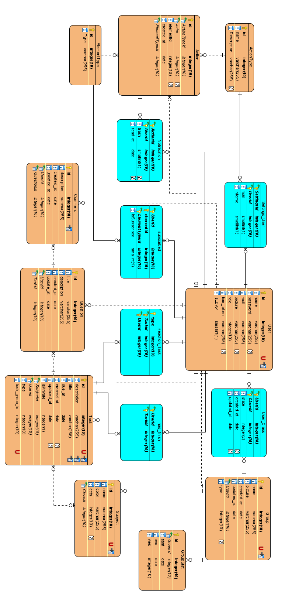
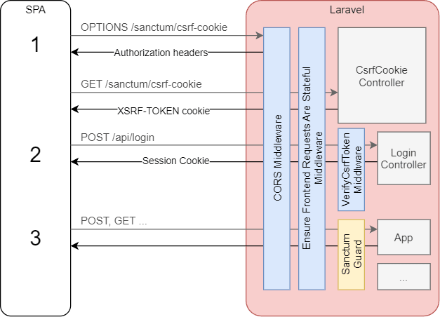

## Résumé

## abstract

\newpage

# Introduction

## Contexte de développement

* Visual Code
* Docker

\newpage

# Cahier des charges

Cette section décrit le cadre initial du projet ainsi que ses buts visés à la fin du développement

## Situation initiale

Ce projet fait suite à un travail réalisé par trois étudiants dans le cadre du cours de Développement Web. Dans le cadre de ce projet les trois étudiants ont réalisé une plateforme Web permettant aux élèves d'inscrire de manière collaborative les différents tâches (devoirs/CP/Projet) à faire.

## Buts visés

Avec Caravel l'idée est que les devoirs soient gérés par les membres d'une classe, chaque membre de la classe a donc la possibilité de renseigner un devoir sur la plateforme. Si celui-ci manque de précision, le professeur ou un élève peut y apporter une modification en tout temps afin d'éclaircir son contenu. Dans cette optique autant les professeurs que les élèves peuvent être une source de devoirs ce qui change la dynamique des élèves par rapport aux applications habituelles.

Un des but de Caravel est de réunir tous les devoirs en un seul endroit, avec l'apparition des différents outils comme Moodle, Teams, l'intranet ou encore les dossiers partagés, il est parfois très difficile de savoir où chercher l'information concernant un devoir. L'idée est donc de permettre aux membres d'une classe de réunir les informations pertinentes en un seul endroit afin de gagner du temps. La contribution collaborative permet de faciliter la transition à l'utilisation de Caravel, si par exemple un prof continue de distribuer ses exercices sous format PDF par des canaux différents, il suffit qu'un seul élève soit au courant de l'information pour la transmettre aux autres en les ajoutant sur Caravel.

De plus Caravel pourra permettre d'ouvrir des fils de discussion au sein d'une tâche afin de demander de l'aide ou des éclaircissement sur une tâche, l'idée est de permettre aux élèves de s'entraider et de partager en un seul lieu les différentes informations (questions/réponses).

Enfin, l'outil devra permettre d'avoir une vue de la charge de travail d'une classe afin de placer au mieux les prochains CP/devoirs, également il sera possible pour un élève de réagir sur les différentes tâches pour alerter les professeurs sur un devoir qui serait inadapté (temps de travail, complexité, manque d'informations, etc...)

Succinctement les buts sont les suivants :

* Placer au mieux les devoirs et CP pour lisser la charge et savoir si la charge de travail est correcte
* Réunir en un seul endroit toutes les informations relatives au travail qui doit être effectuer par l'étudiant et ainsi éviter l'utilisation de différents canaux
* Aider les élèves à mieux s'organiser en ayant une place qui réuni toutes les informations nécessaires à l'exécution correcte de leur travail
* Proposer une plateforme de collaboration entre étudiants et professeurs sur des tâches via des échanges questions/réponses

### Contraintes éventuelles

Pas de contraintes

### Priorisation des tâches

Une priorisation des tâches a été effectuées enfin de déterminé les éléments importants du projet. Cette priorisation est basée sur la @MoScoW.

#### Must have

* Traduction en français
  * Prévoir la possibilité d'ajouter d'autres langues facilement (localisation)
* Filtres sur les tâches dans les différentes vues
  * Filtres par titre, par sujet, par auteur
* Rôles étudiant/professeur
  * Les profs pourront ajouter des tâches, elles ne seront alors pas modifiables par les élèves
* Ajout d'une vue en mois style Outlook
  * Permet de naviguer sur d'anciennes semaines
* Séparation front/back end
  * Passage en Vue.js, Laravel en backend
* Analyse & intégration des feedbacks reçus pendant le semestre de printemps
* Réactions aux différentes tâches
  * Pouvoir réagir une tâche (trop long, trop complexe, etc...)
* Ajout de notion de crédit sur les sujets

#### Should have

* Système de notifications
  * par ex. une tâche a été ajoutée ou modifiée, réponse à un commentaire
* Authentification interne (LDAP)
* Système de sujets(fil) dans les commentaires au niveau des tâches
  * Possibilité d'éditer les commentaires
* Ajout de la représentation de la charge de travail

#### Could have

* PWA
  * Possibilité de notification push
* Possibilité pour un élève de mettre une tâche comme terminée pour lui uniquement
* Partage des tâches privées avec certains membres
* Enrichir l'éditeur de texte
  * ajouter des mentions type \@membre, #idTache
* Gestion des paramètres de notifications
* Onglet "Mes tâches" pour qu'un utilisateur puisse retrouver facilement ses tâches créées
* Contrôle édition d'une tâche simultanée (simpliste)
  * Empêcher la soumissions d'un formulaire si la date de modification a changé entre temps
* Approvisionnement automatique des groupes de classes (étudier la faisabilité)
  * Préremplis avec certains professeurs comme membre
* Vue Semestrielle (voir Gantt)
* Une vue récap/statistique globale pour un groupe

#### Won't have

* Pas de gestion d'édition collaborative simultanée (web socket, style google docs)
* Pas de gestion des tâches transversales (sur plusieurs groupes)

\newpage

# Analyse

La section suivante décrit la partie d'analyse et de conception qui a été faite en amont pendant le dernier semestre de troisième année.

## Problématique

La problématique est divisée en deux parties, une partie concernant les professeurs et une autre les élèves.

### Pour les professeurs

#### Problème 1

Placer au mieux les devoirs et CP pour lisser la charge et savoir si la charge de travail est correcte

##### Solution

Elle repose sur deux propositions, dans un premier temps fournir une vue qui permette au mieux de placer un CP ou un devoir (tout en discutant avec les élèves). Dans un deuxième temps il sera possible pour un élève de réagir sur un devoir à l'aide de réactions qui permettront d'évaluer un devoir (trop long/trop complexe/etc...). Les professeurs pourront alors voir si un devoir a occasionné beaucoup de réactions et donc s'il était adapté ou non. Ces réactions pourront entrainer par la suite des discussions avec les élèves pour améliorer le devoir et à fortiori la participation des élèves.

#### Problème 2

Les profs distribuent souvent des consignes de manière orale ou alors sur des supports spécifiques, avec les différents outils disponibles, rendre les informations sur toutes les différentes plateformes peut être éreintant

##### Solution

Possibilité de déléguer cette tâche aux élèves (ex. le devoir peut être donné de manière orale et être rapporter par un des élèves), étant plus nombreux il est plus facile pour les élèves de centraliser les informations qui leur sont nécessaires pour un devoir plutôt que de laisser cette action à une seule et unique personne.

### Pour les élèves

#### Problème

Les devoirs sont notés et éparpillés sur plusieurs supports (physique ou digital) parmi les élèves, on se retrouve souvent avec un élève qui détient une partie de l'information et non toute l'information. Les élèves ont donc du mal à visualiser tous les devoirs en cours donnés par les professeurs. Il est alors compliqué de prévoir sa charge de travail avec des informations incomplètes

##### Solution

Apporter une vue centralisée dans laquelle il est facile de visualiser les tâches à faire, l'accès collaboratif permet de réunir les fragments d'informations détenus par chaque élève en un seul endroit afin d'obtenir une information complète.

## Etat de l'art

Cette section décrit l'actuel état des applications dans le domaine de gestion des tâches liés à des études, elle décrit notamment quelques tests effectués sur certaines de ces applications et ultimement le positionnement de Caravel par rapport à l'état de l'art.

### Applications testées

* Google Classroom (https://classroom.google.com/)
* MyHomework (https://myhomeworkapp.com/home)
* MyStudyLife (https://app.mystudylife.com/)

#### Google Classroom

L'outil Google Classroom est très axé cours, les professeurs créent leur cours et les élèves suivent les cours qui leurs sont nécessaires (principe universitaire où les élèves peuvent choisir leur cours). L'idée est que les ajouts tels que les devoirs soient introduits uniquement par le professeur. La notion de classe à proprement parler n'existe pas.

{width=250}

{width=250}

{width=400}

{width=400}

Fonctionnalités intéressantes :

* Des annonces peuvent être faites pour la classe
* Il y a une notion de groupes, les devoirs peuvent être distribué à toute la classe ou alors à un groupe plus restreint
* **Les devoirs sont synchronisés directement avec l'agenda Google**

#### MyHomework

MyHomework est une WebApp qui permet la gestion des devoirs personnels.

{width=300}

{width=400}

{width=400}

{width=400}

L'application rend le service minimum (ajout de devoirs) mais ne permet pas la collaboration, il y a beaucoup d'options qui se relèvent pas très utiles dans la majorité des cas.

Fonctionnalités intéressantes :

* Affichage en semaine concise
* Possibilité de rajouter des rappels
* Ajout d'une notion "terminé"

### MyStudyLife

MyStudyLife est une WebApp (disponible aussi sur mobile) qui permet la gestion des horaires de cours ainsi que des tâches à effectuer.

{width=400}

{width=300}

{width=400}

Fonctionnalités intéressantes :

* Gestion des horaires de cours très flexible
* Permet de lier des tâches à un cours et d'effectuer des rappels avant le début du cours
* Permet de gérer les vacances
* Permet de gérer les cours sur différents semestres
* Les notifications push disponibles avec l'application sont très appréciable
* Possède une version web et mobile

### Synthèse

Le marché est partagé en deux catégories : les applications de gestion de devoirs dans lesquelles c'est l'étudiant qui entre les devoirs et l'autre catégorie où ce sont les professeurs qui ajoutent les devoirs.

Pour la première catégorie, il existe actuellement beaucoup d'applications (surtout mobile) qui permettent à un étudiant de gérer ses devoirs mais celles-ci ne permettent pas la collaboration entre étudiants, en outre il n'est pas possible de partager les devoirs avec quelqu'un d'autre.

Pour la seconde catégorie, il existe quelques applications qui permettent à un professeur d'entrer des devoirs pour un groupe d'élèves, ceux-ci peuvent donc alors tous consulter les devoirs. Le problème repose sur le fait que seul le professeur peut entrer les devoirs, cela limite la marge de manœuvre des élèves ainsi que leur implication. Dans ces applications un professeur est souvent responsable de sa matière et ne peut donc pas forcément rajouter des devoirs dans une autre matière (voir Google Classroom).

### Positionnement de Caravel

Dans Caravel l'idée est de se positionner entre les deux mondes, les devoirs seront gérées par les membres d'une classe, chaque membre de la classe a donc la possibilité de renseigner un devoir sur la plateforme. Si celui-ci manque de précision, le professeur ou un élève peut y apporter une modification en tout temps afin d'éclaircir son contenu. Dans cette optique autant les profs que les élèves peuvent être une source de devoir ce qui change la dynamique des élèves par rapport aux applications habituelles.

Un des souhaits de Caravel est aussi de réunir tous les devoirs en un seul endroit, avec l'apparition des différents outils comme Moodle, Teams, l'intranet ou encore les dossiers partagés, il est parfois très difficile de savoir où chercher l'information concernant un devoir. L'idée est donc de permettre aux membres de la classe de réunir les informations pertinentes en un seul endroit afin de gagner du temps.

De plus Caravel pourra permettre d'ouvrir des fils de discussion au sein d'une tâche afin de demander de l'aide ou des éclaircissement sur un détail spécifique, l'idée est de permettre aux élèves de s'entraider sur une question et de partager en un seul lieu les différentes informations sur un devoir, évidemment les professeurs peuvent aussi répondre aux différents fils de discussion.

Enfin, l'outil permet aux élèves de toujours être à jour quant aux tâches à faire, en effet il arrive souvent qu'un élève oublie de noter un devoir ou de détailler certains éléments, Caravel permet de réunir les connaissances des différents élèves et des professeurs pour obtenir une base solide d'informations.

## Conception

Cette partie va s'attèle à décrire les problématiques ainsi que les solutions qui ont été trouvées.

### Rôles et use cases

Cette partie explicite les différents rôles disponibles au sein de caravel ainsi que les actions possibles.

#### Rôles fonctionnels

Il y a un seul rôle fonctionnel qui donc celui d'administrateur du groupe, en général il s'agit du créateur du groupe mais ce droit peut être transmis.

##### Administrateur du groupe

Permet de gérer les paramètres du groupe (suppression, renommage, etc...) ainsi que de gérer les différents membres du groupes (suppression d'un membre).

#### Rôles sémantiques

Les rôles suivants n'auront pas de droits particuliers le but de l'application étant de permettre la collaboration directe entre les deux différents rôles, cependant les actions des professeurs seront mises en avant typiquement dans les fils de discussions. De plus les professeurs seront admis d'office dans les groupes dit de "classe" lors d'une demande d'adhésion.

Les deux rôles seront donc les suivants :

* Professeur
* Elève
  * Rôle par défaut

Il a été décidé de ne pas appliquer de droit spécifique pour l'un ou l'autre des rôles car un historique des actions de chaque utilisateur sera mis en place et donc il possible en tout temps de trouver qui a effectué la moindre modification sur une tâche, il a donc été choisi de laisser libre tout utilisateur de modifier une tâche même s'il en est pas l'auteur. Ceci afin d'encourage la collaboration sur les différentes tâches.

### Use cases

Pour la bonne compréhension des schémas qui vont suivre, il tenir compte du fait qu'un "Utilisateur" est un "Membre du groupe". De plus l'utilisateur est aussi considéré comme "auteur".

#### Tâche

Use cases concernant les différentes actions possibles sur les tâches.


#### Sujet

Use cases concernant les différentes actions possibles sur les sujets.


#### Fil de discussion

Use cases concernant les différentes actions possibles sur les fils de discussion.


#### Notification

Les paramètres de notifications seront globaux et non spécifique à une tâche ou groupe


#### Filtre

Use cases concernant les différentes actions possibles avec les filtres.


#### Login

Use cases concernant les différentes actions possibles lors de l'authentification.


*Les différents schémas ont été produits avec l'outil "Visual Paradigm community edition"*

### Gestion des filtres

Les filtres permettent de filtrer la liste des tâches disponibles. Ils permettent de retrouver une tâche aisément et de retrouver une tâche passée ce qui n'est pas possible sur l'ancienne de version de Caravel.

#### Liste des filtres

Voici une liste exhaustives des filtres qui sont disponibles dans l'application :

* Par sujet
* Par auteur
* Par texte (texte entré par l'utilisateur, recherche dans le titre ainsi que la description)
* Par type de tâches (projet, devoir, CP/examen)
* Par état (clos/ouvert -> passé/futur)
* Par privé/publique

Il sera possible en tout temps de réinitialiser les filtres appliqués pour retrouver l'affichage standard.

### Système de réactions

Le système de réactions sur les tâches a pour but de signaler la présence d'un problème sur cette dernière. L'idée derrière ces réactions est de donner une direction sur la réflexion à entreprendre pour évaluer la problématique d'une tâche dans cette optique les réactions ont pour but de juger de manière qualitative (en terme méthodologique) une tâche.

Pour ce faire nous allons définir une base de réactions qui sera la même sur toutes les tâches et que les élèves pourront utiliser. Il est important que cette base soit commune à toutes les tâches afin que les élèves puissent bien appréhender correctement leur utilisation. En effet des réactions spécifiques à chaque sujet ou groupe demanderait un effort d'assimilation trop conséquent et placerait l'élève dans une situation d'incertitude quant au choix de la réaction ce qui serait contre productif. Le système doit rester simple et pouvoir être assimiler facilement.

La liste exhaustives des réactions :

* {width=20} Trop long
* {width=20} Trop complexe
  * manque de compétences
* {width=20} Manque d'informations
  * donnée pas claire
* {width=20} Je suis perdu
  * la préparation en cours n'est pas optimale pour entreprendre l'exercice
* {width=20} Lien avec le cours pas clair
  * l'intérêt n'est pas clair, pas assez motivée, l'importance du devoir n'est pas comprise par l'étudiant
* {width=20} Peu d'intérêt
  * Par exemple pas de feedback, l'étudiant ne voit pas d'intérêt de s'investir

Plusieurs références ont été utilisées pour déterminer ces réactions :

* Un article de journal écrit dans le American Journal of Engineering Education (AJEE)  @reaction1
* Ainsi que deux autres articles web @reaction2 et @reaction3

#### Participation aux réactions

Afin de pousser les utilisateurs à réagir sur les différentes tâches, un système de trigger pourra être mis en place, en substance, il s'agit de regarder les tâches terminées dans un certains laps de temps très court (1-2 jours) selon un taux de probabilité défini : notifier l'utilisateur afin qu'il réagisse à une tâche, la réaction n'est pas obligatoire.

#### Anonymisation

La question s'est posée quant à l'anonymisation des résultats, une réflexion a été portée en ce sens : le fait d'anonymiser les résultats n'apporte pas de désavantage tandis que l'inverse peut freiner les utilisateurs à donner leur avis. Le choix s'est donc porter sur des réactions anonymes.

### Système de notifications

La construction des notifications au niveau de Laravel sera basée sur le système de notification issue de la [documentation officiel](https://laravel.com/docs/8.x/notifications). Le système de notifications a pu pour de permettre à l'utilisateur de se rendre compte des différentes mise à jour qu'il y a eu lors de leur absence : un devoir ajouté ou une modification sur un devoir peut vite passé inaperçu.

#### Canaux de distribution

Les différents canaux de distribution visés, sont :

* PWA / interne à l'application
* Email

#### Déclenchement des notifications

La liste exhaustive des actions qui peuvent déclencher une notification :

* Ajout d'une tâche
* Modification d'une tâche
* Suppression d'une tâche
* Ajout d'une question dans une tâche
* Ajout d'un commentaire si abonné ou si auteur
  * (par défaut si un utilisateur répond à une question ou s'il est auteur, il devient automatiquement abonné)
* Demande d'ajout au groupe
* Accepté dans un groupe
* Refusé d'un groupe

Les différentes notifications seront paramétrable depuis le compte de l'utilisateur.

{width=350}

### Gestion de la charge de travail

Afin de mieux estimer la charge de travail chaque branche accueillera un nouveau paramètre, le nombre de crédits ETCS (un crédit représente une charge de travail d'environ 25 à 30 heures de travail). Ces crédits servent de critère de pondération pour les différentes branches.

#### Indicateurs

A partir de ces données une cotation **par semaine** est créée : le Work Load Score (WLS). Il s'agit d'un ratio basé sur un autre indicateur, le "Week Effort Score" (WES) et de sa médiane définie par les semaines déjà effectuées.

Les détails des calculs sont donnés par les formules suivantes :

```
$$N_A = Nombre\ de\ devoirs$$

$$N_E = Nombre\ de\ Examens\ ou\ CP$$

$$N_{PS} = Nombre\ de\ projet\ en\ cours\ (qui\ ne\ sont\ pas\ à\ rendre)$$

$$N_{PW} = Nombre\ de\ projet\ à\ rendre$$

$$C_S = Nombre\ de\ crédit\ pour\ le\ sujet\ (cours)$$

$$Week\ Effort\ Score\ (WES) = \sum_{subjects} C_s * (N_E + N_A + N_{PW} + 2 * N_{PS})$$

$$Work\ Load\ Score (WLS) = \frac{WES}{\widetilde{WES}}$$
```

#### Comptabilisation des projets

Les projets sont calculés de manières différentes car on comptabilise un projet sur lequel on doit travailler mais qui n'est pas à rendre cette semaine et un projet qui est à rendre dans dans le courant de la semaine, ce qui engendre en général plus de travail.

#### Normalisation

Le nombre de crédit n'est pas normalisé car tous les cours ne seront pas forcément présents en tout temps et donc il n'est pas possible d'avoir une normalisation linéaire si des sujets viennent s'ajouter au fur et à mesure (dans le cadre où ces informations ne sont pas calculées en temps réel)

#### Gestion des extremums

Le score de certaines semaines risque de poser des problèmes, il faut donc éviter les extremums afin d'avoir une tendance qui soit plus cohérente. Pour éviter ça, la médiane des semaines est utilisée afin d'évaluer si une semaine est plus ou moins chargée

\newpage

### Modélisation de la base de données



\newpage

### Système d'authentification

L'actuel Caravel utilise un système de notification interne à l'application, il est donc nécessaire que chaque nouvel utilisateur d'enregistrer avant de pouvoir se connecter sur l'application. Afin de facilité cette démarche, une solution de SSO avec Google et GitHub ont été mis en place. Dans la nouvelle version de Caravel, on souhaite permettre à l'utilisateur de se connecter via l'annuaire interne de l'école (LDAP). Cela permettra de directement récupérer des infos pertinentes sur l'utilisateur ainsi que de déterminé son statut (professeur ou élève). L'utilisation du LDAP devrait permettre à terme de pouvoir enrôler les utilisateurs directement dans des classes.

## Définitions des routes

Les routes sont définies en utilisant le principe REST et donc avec l'utilisation des verbes HTTP : GET, POST, PUT/PATCH, DELETE. La génération des routes est fait avec l'outil en ligne Swagger (Open API), sur lequel on peut retrouver la [documentation de l'api Caravel](https://app.swaggerhub.com/apis-docs/M4n0x/Caravel/1.0.0#/).

## Stratégie & conception de test

Cette partie décrit la stratégie ainsi que la conception des tests nécessaire au bon fonctionnement de l'application. Il renseigne aussi les risques liés au projet.

### Attentes de la qualité du produit

* Interface facile à utiliser
* Bonne qualité de code
* Site conforme aux normes standard du Web

### Objectifs de tests

Le but des différents tests est de s'assurer que le code produit est de bonne qualité tant dans sa réalisation que dans son fonctionnement, en outre il permet de mettre en place des tests qui permettent de ne pas régresser d'une version à l'autre en maintenant une qualité de produit constante entre les différentes phases de développement.

* Avoir un code maintenable
* Avoir un bon temps de réponse
* Permettre une charge d’au moins 40 personnes

### Périmètre de tests

* Test unitaire avec PHPUnit (et Jest côté Vue.js)
* Qualité de code avec SonarCloud

### Gestion des risques


| Description                                                                                                         |    Source    | Probabilité | Impact | Criticité | Résolution                                                                                                                                              |
| --------------------------------------------------------------------------------------------------------------------- | :-------------: | :------------: | :------: | :----------: | ---------------------------------------------------------------------------------------------------------------------------------------------------------- |
| Retard sur le planning                                                                                              |    Interne    |      4      |   6   |    0.7    | Découper les tâches de manière a facilement pouvoir évaluer le temps de mise en place (éviter les tâches avec trop d'action en même temps)        |
| Login SSO                                                                                                           |    Interne    |      7      |   8   |    0.8    | Voir la documentation, rapidement voir avec un professeur, réévaluer la faisabilité                                                                   |
| L'appel des terrasses et de la bière                                                                               | psychologique |      10      |   5   |    0.5    | boire de la bière sans alcool et éviter tout contact social, par exemple en effectuant du télétravail, afin d'éviter les collègues, ces tentateurs |
| Mauvaise évaluation de la charge de travail du à l'absence de connaissance approfondie sur certaines technologies |    interne    |      8      |   7   |    0.9    | En référé le plus rapidement possible au mandant et adapter les objectifs en fonction de retard pris                                                  |

#### Etapes principales

1. Tests unitaires PHPUnit (et Jest côté VueJS)
2. Tests avec utilisateurs
3. Analyser la qualité de code avec SonarCloud
4. Analyser les résultats dans le rapport de tests

#### Environnement et outils de tests

##### GitHub

Pour l’intégration continue et la livraison continue GitHub sera utilisé.

##### SonarCloud

La version cloud de SonarQube sera utilisée afin d’analyser la qualité du code.

## Maquettes

Cette section regroupe les différentes maquettes créées pour la nouvelle version de Caravel. Ces maquettes ont été réalisées avec l'outil Figma avec une licence étudiante.

{width=600}

{width=600}

{width=450}

{width=500}

{width=500}

{width=500}

Il est de plus possible de consulter la [version interactive](https://www.figma.com/proto/WHGPKvp8GgmoqsaOP7mFlz/Caravel-mockup) de la maquette directement sur le site de Figma.

## Planning

voir annexe Planning.png

## Méthodologie de travail

La méthodologie de travail se base sur l'utilisation GitFlow qui consiste à créer 3 différentes canaux :


1. La branche `master` qui est une branche qui est toujours fonctionnel et stable (release candidate)
2. La branche `develop` qui possède les dernières fonctionnalités mais n'est pas forcément stable
3. Les branches dites `features` qui sont créées pour chaque nouvelle fonctionnalité.

Lorsqu'une `feature` est aboutie et est validée par l'équipe de développement, elle est alors poussée sur la branche `develop` pour validation, pour une fois que la branche `develop` est considérée comme stable, celle-ci peut être poussée sur la branche `master`.

Cette méthodologie implique une bonne analyse en amont des tâches à effectuer ainsi qu'une découpage minutieux des tâches afin de garder des branches `features` simple et concise. Mais permet un suivi clair de l'avancement du projet ainsi qu'une revue plus simple de chaque nouvelle fonctionnalité mais demande un effort supplémentaire (création d'une branche et d'une pull request pour chaque fonctionnalité).

\newpage

# Implémentation

Dans cette section il s'agit d'expliquer les différentes étapes majeures qui ont permis la réalisation du projets ainsi que d'expliciter les différents choix techniques effectués.

## POC

## Authentification

Le processus d'authentification un peu plus complexe dans une application où le frontend et le backend sont séparés, le processus peut être résumé simplement par le schéma suivant :


### Local Storage vs Cookies

La complexité réside dans le choix du stockage du token au niveau du client, en effet une des solutions les plus utilisées est le stockage du token au niveau du Local Storage, cependant il s'agit d'une mauvaise pratique, comme le cite cet article de @localStorage.

L'autre solution consiste à utiliser les cookies ainsi que le flag "httponly" qui bloque l'accès à ce dernier dès que ce flag est paramétré à vrai et c'est la solution qui est recommandée dans la documentation de Laravel, nous y reviendront par la suite dans la section suivante.

### Sanctum vs Passport

Laravel propose deux systèmes d'authentifications, le premier [Sanctum](https://laravel.com/docs/8.x/sanctum) est un système léger d'authentification basé sur des tokens, le second [Passport](https://laravel.com/docs/8.x/passport) est un système d'authentification lourd qui utilise OAuth2, OAuth2 est un protocol qui permet aux utilisateurs la connection avec d'autres applications externe tel que Google ou encore GitHub. Ce dernier est donc plus lourd et présuppose une bonne connaissance du protocole OAuth2. Comme l'utilisation de OAuth2 n'est pas nécessaire, Sanctum a été choisi, c'est d'ailleurs une recommandation issue de la [documentation de Laravel](https://laravel.com/docs/8.x/passport#passport-or-sanctum).

{width=400}

Dans la \ref{figSanctum} 

## DevOps CI/CD

A

### Configuration de environnement

## Configuration de production

## Firebase Cloud Messaging

* Intégration de PWA avec Vue.js, @notif1.
* Intégration de Firebase Cloud Message avec Laravel et Vue.js, @notif2.
* Documentation officiel de Firebase Cloud Message, @notif3.

## Frontend

`typescript`

### Vuex

### Pagination

### Localisation

### Notifications

### Composants

#### Pagination

#### Inputs

### Filtres

### Gestion des erreurs Axios

### Problème de réactivité

Vue.set(...)

### Gestion du chargement

## Backend

### Policies

### Validation des requêtes

`FormRequest`

### Localisation

### Notifications

`Observer`

### Moteur de recherche

### Gestion de clés locales

# User tests

Afin de tester globalement l'application la réalisation d'un test utilisateur à eu lieu à St-Imier, le 07 juillet 2021.

Il y a eu au total 6 personnes interrogées dans le cadre de ce user test, les résultats des différents retours par les utilisateurs sont décrits dans le paragraphe qui suit, il s'agit essentiellement de données brutes.

## Scénario

- Connectez-vous sur Caravel
- Vous êtes dans la classe "INF DLM-B 2021" et vous souhaiteriez créer un espace pour votre classe sur Caravel
- Vous vous souvenez d'un devoir pour le mardi 20 juillet pour le cours d'infographie : "Lire tout le livre de WebGL"  que vous souhaiteriez partager à votre classe à travers Caravel.
- Vous prenez connaissance de l'existence du groupe "INF DLM-B 2019" et vous décidez de rejoindre le groupe.
- Un utilisateur vient d'accepter votre demande d'accès à la classe "INF DLM-B 2019", vous souhaitez maintenant accéder au groupe pour voir ce qu'il contient.
- En arrivant sur le groupe "INF DLM-B 2019" vous apercevez la tâche "Faire l'exercice 1" d'infographie, vous prenez le temps de le lire et décidez que ce travail n'est pas de votre niveau, vous souhaitez réagir à la tâche pour montrer votre opinion.
- Malgré votre réaction, vous entreprenez quand même de réaliser le devoir, vous bloquez immédiatement sur le point 1a, vous souhaitez demander "Comment résoudre l'exo 1a" à vos camarades qui se trouvent sur le groupe.
- En parcourant les diverses tâches du groupe "INF DLM-B 2019" vous apercevez la tâche "Séance de travail", sur celle-ci se trouve une question "A quelle heure à lieu la séance ?" Vous connaissez la réponse (17h30) et décidez d'y répondre.
- En revenant sur votre question que vous avez posée "Comment résoudre l'exo 1a" vous apercevez que quelqu'un a répondu à votre question, la réponse vous convient, vous décidez que cette réponse est suffisante et passez l'état de la question en résolu.
- Grâce à l'aide fournie par vos camarades sur la tâche "Faire l'exercice 1" d'infographie, vous avez réussi l'exercice, vous décidez de marquer cette exercice comme terminé pour vous.
- Vous réalisez que la tâche que vous avez ajoutée "Lire tout le livre de WebGL" était une erreur vous décidez de supprimer cette tâche.
- D'ailleurs vous décidez que le groupe "INF DLM-B 2019" est beaucoup mieux que le groupe que vous avez créé, comme ce dernier n'est plus utile et qu'il n'y a que vous, vous décidez alors de supprimer le groupe.
- Finalement vous avez décidé de changer de classe, vous préférez donc quitter le groupe "INF DLM-B 2019".

## Résultats

En Annexe ?

\newpage

# Améliorations

\newpage

# Conclusion

\newpage

# Annexes

\newpage
