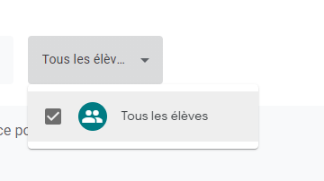
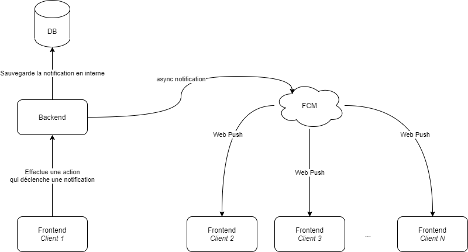

## Résumé {-}


## Abstract {-}

//TODO

\newpage

## Remerciements {-}

Merci à Luca Truscello (truscello.luca@gmail.com) étudiant à L'HEPIA de Genève qui a produit le logo de Caravel.

Merci à MM. Grunenwald, Wohlfahrt et M'Poy, pour le suivi et les conseils avisés ainsi que les débats animés.

Et un merci particulier à Joris Monnet et Maxime Welcklen sans qui ce projet n'aurait pu exister.

\newpage

# Introduction
Le projet Caravel fait suite à un travail réalisé par trois étudiants dans le cadre du cours de *Développement Web*. Lors de ce projet les trois étudiants ont réalisé une plateforme web permettant aux élèves d'inscrire de manière collaborative les différents tâches (devoirs/CP/Projet) à faire. 

Le but de ce projet est donc de pousser Caravel plus loin en y ajoutant de nouvelles fonctionnalités pour le rendre utilisable par la He-Arc. 

Le projet s'articule autours des problématiques suivantes :

* Placer au mieux les devoirs et CP pour lisser la charge et savoir si la charge de travail est correcte
* Réunir en un seul endroit toutes les informations relatives au travail qui doit être effectué par l'étudiant et ainsi éviter l'utilisation de différents canaux
* Aider les élèves à mieux s'organiser en ayant une place qui réuni toutes les informations nécessaires à l'exécution de leur travail
* Proposer une plateforme de collaboration entre étudiants et professeurs sur des tâches via des échanges questions/réponses

Dans la suite du document nous allons voir en détails les objectifs de Caravel. Puis à partir de ces objectifs une analyse des différents problématiques sera proposée. Une fois exposées, la place sera laissée à la conception dans laquelle nous verrons de manière abstraite comment résoudre ces différentes problématiques. Ces aspects éclaircis, nous pourrons passer à l'implémentation de la solution. Finalement nous verrons certains points d'amélioration au sein de la solution proposée.

\newpage

# Cahier des charges

Cette section décrit le cadre du projet ainsi que ses buts visés à la fin du développement

## Buts visés

Avec Caravel l'idée est que les devoirs soient gérés par les membres d'une classe, chaque membre de la classe a donc la possibilité de renseigner un devoir sur la plateforme. Si celui-ci manque de précision, le professeur ou un élève peut y apporter une modification en tout temps afin d'éclaircir son contenu. Dans cette optique autant les professeurs que les élèves peuvent être une source de devoirs ce qui change la dynamique des élèves par rapport aux applications habituelles.

Un des buts de Caravel est de réunir tous les devoirs en un seul endroit, avec l'apparition des différents outils comme Moodle, Teams, l'intranet ou encore les dossiers partagés, il est parfois très difficile de savoir où chercher l'information concernant un devoir. L'idée est donc de permettre aux membres d'une classe de réunir les informations pertinentes en un seul endroit afin de gagner du temps. La contribution collaborative permet de faciliter la transition à l'utilisation de Caravel, si par exemple un prof continue de distribuer ses exercices sous format PDF par des canaux différents, il suffit qu'un seul élève soit au courant de l'information pour la transmettre aux autres en les ajoutant sur Caravel.

De plus Caravel pourra permettre d'ouvrir des fils de discussion au sein d'une tâche afin de demander de l'aide ou des éclaircissement sur une tâche, l'idée est de permettre aux élèves de s'entraider et de partager en un seul lieu les différentes informations (questions/réponses).

Enfin, l'outil devra permettre d'avoir une vue de la charge de travail d'une classe afin de placer au mieux les prochains CP/devoirs, il sera également possible pour un élève de réagir sur les différentes tâches pour alerter les professeurs sur un devoir qui serait inadapté (temps de travail, complexité, manque d'informations, etc...)

Succinctement les buts sont les suivants :

* Placer au mieux les devoirs et CP pour lisser la charge et savoir si la charge de travail est correcte
* Réunir en un seul endroit toutes les informations relatives au travail qui doit être effectué par l'étudiant et ainsi éviter l'utilisation de différents canaux
* Aider les élèves à mieux s'organiser en ayant une place qui réuni toutes les informations nécessaires à l'exécution de leur travail
* Proposer une plateforme de collaboration entre étudiants et professeurs sur des tâches via des échanges questions/réponses

### Priorisation des tâches

Une priorisation des tâches a été effectuée enfin de déterminer les éléments importants du projet. Cette priorisation est basée sur la méthode de MoSCoW [voir @MoScoW].

#### Must have

* Traduction en français
  Prévoir la possibilité d'ajouter d'autres langues facilement (localisation)
* Filtres sur les tâches dans les différentes vues
  * Filtres par titre, par sujet, par auteur
* Rôles étudiant/professeur
* Ajout d'une vue en mois style Outlook
  * Permet de naviguer sur d'anciennes semaines
* Séparation front/back end
  * Passage en Vue.js pour le frontend et Laravel pour le backend
* Analyse & intégration des feedbacks reçus pendant le semestre de printemps
* Réactions aux différentes tâches
  * Pouvoir réagir une tâche (trop long, trop complexe, etc...)
* Ajout de notion de crédits ECTS sur les sujets

#### Should have

* Système de notifications
  * par ex. une tâche a été ajoutée ou modifiée, réponse à un commentaire
* Authentification interne (LDAP)
* Système de sujets (fil) dans les commentaires au niveau des tâches
  * Possibilité d'éditer les commentaires
* Ajout de la représentation de la charge de travail

#### Could have

* PWA
  * Possibilité de notification push
* Possibilité pour un élève de mettre une tâche comme terminée pour lui uniquement
* Partage des tâches privées avec certains membres
* Enrichir l'éditeur de texte
  * ajouter des mentions type \@membre, #idTache
* Gestion des paramètres de notifications
* Onglet "Mes tâches" pour qu'un utilisateur puisse retrouver facilement ses tâches créées
* Contrôle édition d'une tâche simultanée (simpliste)
  * Empêcher la soumissions d'un formulaire si la date de modification a changé entre temps
* Approvisionnement automatique des groupes de classes (étudier la faisabilité)
  * Préremplis avec certains professeurs comme membre
* Vue Semestrielle (voir Gantt)
* Une vue récap/statistique globale pour un groupe

#### Won't have

* Pas de gestion d'édition collaborative simultanée (web socket, style google docs)
* Pas de gestion des tâches transversales (sur plusieurs groupes)

\newpage

# Analyse

La section suivante décrit la partie d'analyse et de conception qui a été faite en amont pendant le dernier semestre de troisième année.

## Problématique

La problématique est divisée en deux parties, une partie concernant les professeurs et une autre les élèves.

### Pour les professeurs

#### Problème 1

Placer au mieux les devoirs et CP pour lisser la charge et savoir si la charge de travail est correcte.

##### Solution

Elle repose sur deux propositions, dans un premier temps fournir une vue qui permette au mieux de placer un CP ou un devoir (tout en discutant avec les élèves). Dans un deuxième temps il sera possible pour un élève de réagir sur un devoir à l'aide de réactions qui permettront d'évaluer un devoir (trop long/trop complexe/etc...). Les professeurs pourront alors voir si un devoir a occasionné beaucoup de réactions et donc s'il était adapté ou non. Ces réactions pourront entrainer par la suite des discussions avec les élèves pour améliorer la tâche et à fortiori la participation des élèves.

#### Problème 2

Les professeurs distribuent souvent des consignes de manière orale ou alors sur des supports spécifiques, avec les différents outils disponibles, mettre les informations sur toutes les différentes plateformes peut être éreintant.

##### Solution

Possibilité de déléguer cette tâche aux élèves (ex. le devoir peut être donné de manière orale et être introduit sur Caravel par un élève), étant plus nombreux il est plus facile pour les élèves de centraliser les informations qui leur sont nécessaires pour un devoir plutôt que de laisser cette action à une seule et unique personne.

### Pour les élèves

#### Problème

Les devoirs sont notés et éparpillés sur plusieurs supports (physique ou digital) parmi les élèves, on se retrouve souvent avec un élève qui détient une partie de l'information et non toute l'information. Les élèves ont donc du mal à visualiser tous les devoirs à faire. Il est alors compliqué de prévoir sa charge de travail avec des informations incomplètes

##### Solution

Apporter une vue centralisée dans laquelle il est facile de visualiser les tâches à faire, l'accès collaboratif permet de réunir les fragments d'informations détenus par chaque élève en un seul endroit afin d'obtenir une information complète.

## Etat de l'art

Cette section décrit l'état des applications dans le domaine de gestion des tâches liés au monde estudiantin, elle décrit notamment quelques tests effectués sur certaines de ces applications et ultimement le positionnement de Caravel par rapport à l'état de l'art.

### Applications testées

* [Google Classroom](https://classroom.google.com/)
* [MyHomework](https://myhomeworkapp.com/home)
* [MyStudyLife](https://app.mystudylife.com/)

#### Google Classroom

L'outil Google Classroom est très axé cours, les professeurs créent leur cours et les élèves suivent les cours qui leur sont nécessaires (principe universitaire où les élèves peuvent choisir leur cours). L'idée est que les ajouts tels que les devoirs soient introduits uniquement par le professeur. La notion de classe à proprement parler n'existe pas.

##### Type de publication
Il existe une liste de publication possible dans classroom.

{width=250}

Comme le montre la figure \ref{classroom1}, celle-ci ne se limite pas seulement à des devoirs mais aussi à des questions.


##### Gestion des accès
Les accès peuvent être gérés finement dans Google Classroom.

{width=250}

Ainsi il est possible de créer des groupes d'élèves afin de faire des partages spécifiques, comme dans la figure \ref{classroom2}.


##### Annonces
Des annonces peuvent être émises par tous au sein de la classe.

{width=400}

Comme le montre la figure \ref{classroom3}, ces annonces apparaissent dans la vue centrale de l'application, ce qui peut être pratique pour faire des rappels rapides.

##### Vue calendrier
La vue calendrier disponible pour les différentes tâches est limitée à la semaine.

{width=400}

##### Conclusion

Comme le montre la figure \ref{classroom4}, cela donne une bonne idée de la charge de la semaine, il est cependant dommage de ne pas trouver une vue mensuelle.

Fonctionnalités intéressantes :

* Des annonces peuvent être faites pour la classe
* Il y a une notion de groupes, les devoirs peuvent être distribués à toute la classe ou alors à un groupe plus restreint
* Les devoirs sont synchronisés directement avec l'agenda Google

#### MyHomework

MyHomework est une WebApp qui permet la gestion des devoirs personnels.

##### Ajout de devoir
L'interface d'ajout d'un devoir est très lourde.

{width=300}

Il y a beaucoup d'options qui, la plupart du temps, ne sont pas nécessaire, voir la figure \ref{myhomework1}.

##### Vue centrale simple
La vue centrale de l'application est claire et efficace.

{width=400}

Elle permet de voir simplement les tâches qui doivent être effectuées, comme on peut le voir dans la figure \ref{myhomework2}.

##### Vue mois 
La vue mois est très basique, elle ne permet pas de voir directement les tâches à effectuer.

{width=400}

Il faut cliquer sur le jour pour avoir des détails sur les tâches, comme sur la figure \ref{myhomework3}.

##### Vue semaine
Cette vue semaine permet de clairement voir les tâches à effectuer pour la semaine en cours.

{width=400}

Elle contient assez de détails pour ne pas être obligé d'ouvrir la tâche, comme le montre la figure \ref{myhomework4}.

##### Conclusion

L'application rend le service minimum (ajout de devoirs) mais ne permet pas la collaboration, il y a beaucoup d'options qui peuvent perdre l'utilisateur.

Fonctionnalités intéressantes :

* Affichage en semaine concise
* Possibilité de rajouter des rappels
* Ajout d'une notion "terminé"

#### MyStudyLife

MyStudyLife est une WebApp (disponible aussi sur mobile) qui permet la gestion des horaires de cours ainsi que la gestion des tâches à effectuer.

##### Vue centrale
La vue centrale de l'application permet de visualiser clairement les différentes tâches à effectuer.

{width=400}

Comme le montre la figure \ref{mystudy1}, celle-ci et très simple, de plus il est possible de directement marqué les tâches comme terminées.

##### Gestion des sujets
La gestion des sujets a l'avantage d'apparaitre très simple.

{width=300}

Il est possible de facilement ajouter un nouveau sujet depuis la création d'une tâche, comme le montre la figure \ref{mystudy2}.

##### Gestion des cours
Il est possible de gérer son horaire de cours de manière très fine, par exemple on peut donner des cours avec des rotations (une semaine sur deux) ou sur un semestre.

{width=400}

Comme on peut le voir sur la figure \ref{mystudy3}. Ceci permet d'automatiquement pré-remplir certains champs, par exemple lors d'un ajout d'une tâche si un cours est en cours alors la tâche sera pré-rempli avec ce cours.

##### Conclusion

Fonctionnalités intéressantes :

* Gestion des horaires de cours très flexible
* Permet de lier des tâches à un cours et d'effectuer des rappels avant le début du cours
* Permet de gérer les vacances
* Permet de gérer les cours sur différents semestres
* Les notifications push disponibles avec l'application sont très appréciables
* Possède une version web et mobile

### Synthèse

Le marché est partagé en deux catégories : les applications de gestion de devoirs dans lesquelles c'est l'étudiant qui entre les devoirs et l'autre catégorie où ce sont les professeurs qui ajoutent les devoirs.

Pour la première catégorie, il existe actuellement beaucoup d'applications (surtout mobile) qui permettent à un étudiant de gérer ses devoirs mais celles-ci ne permettent pas la collaboration entre étudiants, en outre il n'est pas possible de partager les devoirs avec quelqu'un d'autre.

Pour la seconde catégorie, il existe quelques applications qui permettent à un professeur d'entrer des devoirs pour un groupe d'élèves, ceux-ci peuvent alors tous consulter les devoirs. Le problème repose sur le fait que seul le professeur peut entrer les devoirs, cela limite la marge de manœuvre des élèves ainsi que leur implication. Dans ces applications un professeur est souvent responsable de sa matière et ne peut donc pas forcément rajouter des devoirs dans une autre matière (voir Google Classroom).

### Positionnement de Caravel

Dans Caravel l'idée est de se positionner entre les deux mondes, les devoirs seront gérés par les membres d'une classe, chaque membre de la classe a donc la possibilité de renseigner un devoir sur la plateforme. Si celui-ci manque de précision, le professeur ou un élève peut y apporter une modification en tout temps afin d'éclaircir son contenu. Dans cette optique autant les profs que les élèves peuvent être une source de devoirs ce qui change la dynamique des élèves par rapport aux applications habituelles.

Un des souhaits de Caravel est aussi de réunir tous les devoirs en un seul endroit. Avec l'apparition des différents outils comme Moodle, Teams, l'intranet ou encore les dossiers partagés, il est parfois très difficile de savoir où chercher l'information concernant un devoir. L'idée est donc de permettre aux membres de la classe de réunir les informations pertinentes en un seul endroit afin de gagner du temps.

De plus Caravel pourra permettre d'ouvrir des fils de discussion au sein d'une tâche afin de demander de l'aide ou des éclaircissement sur un détail spécifique, l'idée est de permettre aux élèves de s'entraider sur une question et de partager en un seul lieu les différentes informations sur un devoir, évidemment les professeurs peuvent aussi répondre aux différents fils de discussion.

Enfin, l'outil permet aux élèves de toujours être à jour quant aux tâches à faire, en effet il arrive souvent qu'un élève oublie de noter un devoir ou de détailler certains éléments, Caravel permet de réunir les connaissances des différents élèves et des professeurs pour obtenir une base solide d'informations.

## Conception

Cette partie décrit les problématiques ainsi que les solutions qui ont été trouvées.

### Rôles

Cette partie explicite les différents rôles disponibles au sein de caravel ainsi que les actions possibles.

#### Rôles fonctionnels

Il y a un seul rôle fonctionnel qui est celui d'administrateur du groupe, en général il s'agit du créateur du groupe mais ce droit peut être transmis.

##### Administrateur du groupe

Permet de gérer les paramètres du groupe (suppression, renommage, etc...) ainsi que de gérer les différents membres du groupes (suppression d'un membre).

#### Rôles sémantiques

Les rôles suivants n'auront pas de droits particuliers, le but de l'application étant de permettre la collaboration directe entre eux, cependant les actions des professeurs seront mises en avant, typiquement dans les fils de discussions. De plus les professeurs seront admis d'office dans les groupes dit de "classe" lors d'une demande d'adhésion.

Les deux rôles seront donc les suivants :

* Professeur
* Elève

Il a été décidé de ne pas appliquer de droit spécifique pour l'un ou l'autre des rôles car un historique des actions de chaque utilisateur sera mis en place et donc il possible en tout temps de trouver qui a effectué la moindre modification sur une tâche, tout utilisateur est libre de modifier une tâche même s'il en est pas l'auteur. Ceci afin d'encourager la collaboration sur les différentes tâches.

### Use cases

Pour la bonne compréhension des schémas qui vont suivre, il tenir compte du fait qu'un `Utilisateur` est un `Membre du groupe`. De plus l'utilisateur est aussi considéré comme un `auteur`.

#### Tâche

Use case concernant les différentes actions possibles sur les tâches.


#### Sujet

Use case concernant les différentes actions possibles sur les sujets.


#### Fil de discussion

Use case concernant les différentes actions possibles sur les fils de discussion.


#### Notification

Les paramètres de notifications seront globaux et non spécifique à une tâche ou groupe


#### Filtre

Use case concernant les différentes actions possibles avec les filtres.

{width=300}

#### Login

Use case concernant les différentes actions possibles lors de l'authentification.

{width=300}

*Les différents schémas ont été produits avec l'outil [Visual Paradigm community edition](https://www.visual-paradigm.com/).*

### Gestion des filtres

Les filtres permettent de d'affiner la liste des tâches disponibles. Ils permettent de retrouver une tâche aisément et de retrouver une tâche passée ce qui n'est pas possible sur l'ancienne de version de Caravel.

#### Liste des filtres

Voici une liste exhaustives des filtres qui sont disponibles dans l'application :

* Par sujet
* Par auteur
* Par texte (texte entré par l'utilisateur, recherche dans le titre ainsi que la description)
* Par type de tâches (projet, devoir, CP/examen)
* Par état (clos/ouvert -> passé/futur)
* Par privé/publique

Il sera possible en tout temps de réinitialiser les filtres appliqués pour retrouver l'affichage standard.

### Système de réactions

Le système de réactions sur les tâches a pour but de signaler la présence d'un problème sur ces dernières. L'idée derrière ces réactions est de donner une direction sur la réflexion à entreprendre pour évaluer la problématique d'une tâche dans cette optique les réactions ont pour but de juger de manière qualitative (en terme méthodologique) une tâche.

Pour ce faire nous allons définir une base de réactions qui sera la même sur toutes les tâches et que les élèves pourront utiliser. Il est important que cette base soit commune à toutes les tâches afin que les élèves puissent appréhender correctement leur utilisation. En effet des réactions spécifiques à chaque sujet ou groupe demanderait un effort d'assimilation trop conséquent et placerait l'élève dans une situation d'incertitude quant au choix de la réaction, ce qui serait contre productif. Le système doit rester simple et pouvoir être assimiler facilement.

La liste exhaustives des réactions :

* {width=20} Trop long
* {width=20} Trop complexe
  * manque de compétences
* {width=20} Manque d'informations
  * donnée pas claire
* {width=20} Je suis perdu
  * la préparation en cours n'est pas optimale pour entreprendre l'exercice
* {width=20} Lien avec le cours pas clair
  * l'intérêt n'est pas clair, pas assez motivé, l'importance du devoir n'est pas comprise par l'étudiant
* {width=20} Peu d'intérêt
  * Par exemple pas de feedback, l'étudiant ne voit pas d'intérêt de s'investir

Plusieurs références ont été utilisées pour déterminer ces réactions :

* Un article de journal écrit dans le American Journal of Engineering Education (AJEE)  [voir @reaction1].
* Ainsi que deux autres articles en ligne de [voir @reaction2] et de [voir @reaction3].

#### Inciter à réagir {#goreact}

Afin de pousser les utilisateurs à réagir sur les différentes tâches, un système de déclenchement pourra être mis en place, en substance, il s'agit de regarder les tâches terminées dans un certains laps de temps très court (1-2 jours) selon un taux de probabilité défini : notifier l'utilisateur afin qu'il réagisse à une tâche, la réaction n'est pas obligatoire.

#### Anonymisation

La question s'est posée quant à l'anonymisation des résultats, une réflexion a été portée en ce sens : le fait d'anonymiser les résultats n'apporte pas de désavantage tandis que l'inverse peut freiner les utilisateurs à donner leur avis. Le choix s'est donc porter sur des réactions anonymes.

### Système de notifications

Les notifications sont des éléments importants car ils permettent aux utilisateurs de toujours rester à jour par rapport au contenu de leurs groupes.

#### Canaux de distribution

Les différents canaux de distribution visés, sont :

* PWA / interne à l'application
* Email

#### Déclenchement des notifications

La liste exhaustive des actions qui peuvent déclencher une notification :

* Ajout d'une tâche
* Modification d'une tâche
* Suppression d'une tâche
* Ajout d'une question dans une tâche
* Ajout d'un commentaire si abonné ou si auteur
  * (par défaut si un utilisateur répond à une question ou s'il est auteur, il devient automatiquement abonné)
* Demande d'ajout au groupe
* Accepté dans un groupe
* Refusé d'un groupe

Les différentes notifications peuvent être paramétrables depuis le compte de l'utilisateur.

{width=350}

### Gestion de la charge de travail

Afin de mieux estimer la charge de travail, chaque branche accueillera un nouveau paramètre, le nombre de crédits [ECTS](https://fr.wikipedia.org/wiki/Syst%C3%A8me_europ%C3%A9en_de_transfert_et_d%27accumulation_de_cr%C3%A9dits) (un crédit représente une charge de travail d'environ 25 à 30 heures de travail). Ces crédits servent de critère de pondération pour les différentes indicateurs.

#### Indicateurs {#theorywes}

A partir de ces données une cotation **par semaine** est créée : le Work Load Score (WLS). Il s'agit d'un ratio basé sur un autre indicateur, le "Week Effort Score" (WES) et de sa médiane définie par les semaines déjà effectuées.

Les détails des calculs sont donnés par les formules suivantes :

$$N_A = Nombre\ de\ devoirs$$

$$N_E = Nombre\ d'Examens\ ou\ CP$$

$$N_{PS} = Nombre\ de\ projet\ en\ cours\ (qui\ ne\ sont\ pas\ \grave{a}\ rendre)$$

$$N_{PW} = Nombre\ de\ projet\ \grave{a}\ rendre$$

$$C_S = Nombre\ de\ cr\acute{e}dits\ pour\ le\ sujet\ (cours)$$

$$Week\ Effort\ Score\ (WES) = \sum_{subjects} C_s * (N_E + N_A + N_{PW} + 2 * N_{PS})$$

$$Work\ Load\ Score (WLS) = \frac{WES}{\widetilde{WES}}$$

#### Comptabilisation des projets

Les projets sont calculés de manières différentes car on comptabilise un projet sur lequel on doit travailler mais qui n'est pas à rendre cette semaine et un projet qui est à rendre dans dans le courant de la semaine, ce qui engendre en général plus de travail.

#### Normalisation

Le nombre de crédit n'est pas normalisé car tous les cours ne seront pas forcément présents en tout temps et donc il n'est pas possible d'avoir une normalisation homogène si des sujets viennent s'ajouter au fur et à mesure (dans le cadre où ces informations ne sont pas calculées en temps réel).

#### Gestion des extrema

Le score de certaines semaines risque de poser des problèmes, il faut donc éviter les extrema afin d'avoir une tendance qui soit plus cohérente. Pour éviter ça, la médiane des semaines est utilisée afin d'évaluer si une semaine est plus ou moins chargée

### Modélisation de la base de données
La base de donnée a été modélisée avec l'outil [Visual Paradigm](https://www.visual-paradigm.com/).

{width=650}

Dans la figure \ref{database}, les relations `Many-to-Many` sont exprimées en bleu.

### Système d'authentification

L'actuel Caravel utilise un système d'authentification interne à l'application, il est donc nécessaire que chaque nouvel utilisateur s'enregistre avant de pouvoir se connecter sur l'application. Afin de faciliter cette démarche, une solution de SSO avec Google et GitHub a été mise en place. Dans la nouvelle version de Caravel, on souhaite permettre à l'utilisateur de se connecter via l'annuaire interne de l'école (LDAP). Cela permettra de directement récupérer des infos pertinentes sur l'utilisateur ainsi que de déterminer son rôle (professeur ou élève). L'utilisation du LDAP devrait permettre à terme de pouvoir enrôler les utilisateurs directement dans des classes.

## Définitions des routes

Les routes sont définies en utilisant le principe REST et donc avec l'utilisation des verbes HTTP : GET, POST, PUT/PATCH, DELETE. La génération des routes est documentée avec l'outil en ligne Swagger (OpenAPI), sur lequel on peut retrouver la [documentation de l'API Caravel](https://app.swaggerhub.com/apis-docs/M4n0x/Caravel/1.0.0#/).

## Stratégie & conception de test

Cette partie décrit la stratégie ainsi que la conception des tests nécessaires au bon fonctionnement de l'application. Il renseigne aussi les risques liés au projet.

### Attentes de la qualité du produit

* Interface facile à utiliser
* Bonne qualité de code
* Site conforme aux normes standard du Web

### Objectifs de tests

Le but des différents tests est de s'assurer que le code produit est de bonne qualité tant dans sa réalisation que dans son fonctionnement, en outre il permet de mettre en place des tests qui permettent de ne pas régresser d'une version à l'autre en maintenant une qualité de produit constante entre les différentes phases de développement.

* Avoir un code maintenable
* Avoir un bon temps de réponse
* Permettre une charge d’au moins 40 personnes

### Périmètre de tests

* Test unitaire avec PHPUnit (et Jest côté Vue.js)
* Test d'utilisabilité (Usability test)
* Qualité du code avec SonarCloud

### Gestion des risques
La gestion des risques s'effectue par le calcul suivant :
 
$$ C = P * I $$

Où C = Criticité, P = Probabilité [0,1] et I = impact [0,10].


| Description | Source | Probabilité | Impact | Criticité | Résolution |
| ----------------------- | :-------------: | :------------: | :------: | :----------: | ------------------------ |
| Retard sur le planning |    Interne    |      0.4      |   6   |    2.4    | Découper les tâches de manière a facilement pouvoir évaluer le temps de mise en place (éviter les tâches avec trop d'action en même temps)        |
| Login LDAP |    Interne    |      0.7      |   5   |    3.5    | Voir la documentation, rapidement voir avec un professeur, réévaluer la faisabilité |
| Mauvaise évaluation de la charge de travail du à l'absence de connaissance approfondie sur certaines technologies |    interne    |      8      |   7   |    5.6    | En référer le plus rapidement possible au mandant et adapter les objectifs en fonction de retard pris |


#### Etapes principales

1. Tests unitaires PHPUnit (et Jest côté Vue.js)
2. Tests avec les utilisateurs
3. Analyser la qualité de code avec SonarCloud
4. Analyser les résultats dans le rapport de tests

#### Environnement et outils de tests

##### GitHub

Pour l’intégration continue et la livraison continue GitHub sera utilisé.

##### SonarCloud

La version cloud de SonarQube sera utilisée afin d’analyser la qualité du code.

## Maquettes

Cette section regroupe les différentes maquettes créées pour la nouvelle version de Caravel. Ces maquettes ont été réalisées avec l'outil Figma avec une licence étudiante.

### Page de login
Cette maquette présente la page avec laquelle l'utilisateur pourra se connecter.

{width=600}

### Page des tâches
Cette page a pour but d'afficher de chronologique les différentes tâches à faire, ainsi en un coup d'œil il est possible de voir quels sont les tâches les plus pressantes.

{width=600}

### Page d'affichage d'une tâche 
Cette maquette présente l'affichage d'une tâche et des éléments qui la compose.

{width=450}

### Page vue mensuelle
Cette maquette présente la vue mensuelle sur laquelle la charge de travail peut être facilement visible.

{width=500}

### Page chronologique
Cette maquette représente la vue "Gantt" ou encore appelée vue "chronologique", elle permet de voir l'ensemble des tâches à l'année.

{width=500}

### Page de statistiques
Cette maquette représente ce à quoi pourrait ressembler la page de statistiques, 

{width=500}

### Maquette interactive
Il est de plus possible de consulter la [version interactive](https://www.figma.com/proto/WHGPKvp8GgmoqsaOP7mFlz/Caravel-mockup) de la maquette directement sur le site de Figma.

## Planning

Voir annexe \ref{an2}.

## Méthodologie de travail

La méthodologie de travail se base sur l'utilisation GitFlow qui consiste à créer 3 différentes canaux :


1. La branche `master` qui est une branche qui est toujours fonctionnelle et stable (release candidate)
2. La branche `develop` qui possède les dernières fonctionnalités mais n'est pas forcément stable
3. Les branches dites `features` qui sont créées pour chaque nouvelle fonctionnalité.

Lorsqu'une `feature` est aboutie et est validée par l'équipe de développement, elle est alors poussée sur la branche `develop` pour validation, pour une fois que la branche `develop` est considérée comme stable, celle-ci peut être poussée sur la branche `master`.

Cette méthodologie implique une bonne analyse en amont des tâches à effectuer ainsi qu'un découpage minutieux des tâches afin de garder des branches `features` simple et concise. Cela permet un suivi clair de l'avancement du projet ainsi qu'une revue plus efficace de chaque nouvelle fonctionnalité mais demande un effort supplémentaire (création d'une branche et d'une pull request pour chaque fonctionnalité).

\newpage

# Implémentation

Dans cette section il s'agit d'expliquer les différentes étapes majeures qui ont permis la réalisation du projet ainsi que d'expliciter les différents choix techniques effectués.

## DevOps CI/CD

Cette section explique comment a été mis en place le déploiement automatique ainsi que les différentes pipeline de test.

### Intégration continue

L'intégration continue consiste à faire des livraisons continues ainsi que de mettre en place des tests afin de vérifier que ces livraisons soient stables. Ces livraisons continues sont en partie réalisées grâce à la méthodologie GitFlow et aux GitHub actions

#### Laravel

Laravel possède deux pipelines de test, une qui utilise MySQL (MariaDB) et une autre SQLite, cette façon de faire nous garantit une certaine abstraction entre l'utilisation de la base de donnée et notre code, en effet chaque moteur de base de données possède des particularités en utilisant deux systèmes de base de données on peut garantir l'interpolation entre les deux différents types de base de donnée.

En plus du test de connexion à la base de donnée, les tests unitaires PHPUnit sont lancés en fin de traitement pour les deux pipelines.

```{.yml caption="DevOps : pipeline de test Laravel SQLite"}
# Fichier : .github\workflows\laravel.yml

name: Laravel CI SQLite fast

on:
  push:

defaults:
  run:
    working-directory: ./backend

jobs:
  tests:
    runs-on: ubuntu-latest

    steps:
    - uses: actions/checkout@v2
    - name: Copy .env
      run: php -r "file_exists('.env') || copy('.env.example', '.env');"
    - name: Setup PHP
      uses: shivammathur/setup-php@v2
      with:
        php-version: '7.4'
    - name: Install composer Dependencies
      run: composer install -q --no-ansi --no-interaction --no-scripts --no-progress --prefer-dist
    - name: Generate key
      run: php artisan key:generate
    - name: Directory Permissions
      run: chmod -R 777 storage bootstrap/cache
    - name: Create Database
      run: |
        mkdir -p database
        touch database/database.sqlite
    - name: Execute tests (Unit and Feature tests) via PHPUnit
      env:
        DB_CONNECTION: sqlite
        DB_DATABASE: database/database.sqlite
      run: |
        php artisan migrate --seed
        vendor/bin/phpunit
```

La version MySQL est similaire à cette dernière, seule la configuration de la base de données change.

### Livraison continue

La livraison est une étape qui consiste à déployer de manière automatique dès qu'une modification de code est effectuée. Ainsi notre application reflète toujours l'état actuel du code.

#### Configuration du serveur

Le déploiement automatique ne s'occupe que de mettre les données de l'application à jour, elle ne s'occupera pas de la configuration totale du serveur qui nécessite plusieurs composants indépendants (NPM, Nginx, Compoter, PHP, MariaDB, etc...). Il faut donc s'atteler à créer une configuration minimale du serveur pour accueillir notre backend ainsi que notre frontend.

```{.bash caption="Serveur : installation des dépendences de base"}
#Server database mariadb
sudo apt install mariadb-server

# NPM pour VueJs
sudo apt install npm 

# PHP et de ses dépendances
sudo apt install php7.4 libapache2-mod-php7.4 php7.4-curl php-pear php7.4-gd php7.4-dev php7.4-zip php7.4-mbstring php7.4-mysql php7.4-xml curl php7.4-ldap -y

# Composer pour les dépendances php
sudo apt install composer
```

#### Configuration de MariaDB

Afin de garder la base de donnée de Caravel dans un vase clos, un utilisateur spécifique est créé pour accéder aux données de Caravel.

```{.sql caption="Serveur : création de la db et d'un user particulier"}
CREATE DATABASE Caravel;

grant all privileges on Caravel.* TO 'Caravel'@'localhost' identified by 'PLACERHOLDER_PASSWORD';

flush privileges;
```

#### Configuration de Nginx

Dans un premier temps, il a été choisi de séparer le backend et le frontend via deux sous domaines différents à savoir `caravel.ing.he-arc.ch/` pour la partie frontend et `api.caravel.ing.he-arc.ch/` mais après plusieurs tests, il semble que cela ne soit pas possible en tout cas en l'état, car le sous domaine api.* n'est pas redirigé sur le serveur, il faudrait donc ajouter une entrée DNS supplémentaire au niveau du service informatique. Afin de ne pas perdre de temps sur la partie configuration, il a été choisi en définitive de faire passer l'api sur une route spécifique c'est-à-dire `caravel.ing.he-arc.ch/api`. La configuration suivante du Nginx reflète ce dernier choix.

```{.bash caption="Serveur : configuration Nginx"}
  # Caravel conf
server {
  index index.php index.html;
  root /var/www/caravel/backend/public;
  server_name caravel.ing.he-arc.ch;
  client_max_body_size 210M;

  location / {
      root /var/www/caravel/frontend/dist;
      try_files $uri /index.html;
  }

  location /api {
      try_files $uri $uri/ /index.php?$query_string;
  }

  location ^~ /uploads/ {
      root /var/www/caravel/backend/public/;
  }

  location ~ \.php$ {
      fastcgi_pass unix:/var/run/php/php7.4-fpm.sock;
      fastcgi_index index.php;
      fastcgi_param SCRIPT_FILENAME $realpath_root$fastcgi_script_name;
      include fastcgi_params;
  }

    listen 443 ssl http2; # managed by Certbot
    ssl_certificate /etc/letsencrypt/live/caravel.ing.he-arc.ch/fullchain.pem; # managed by Certbot
    ssl_certificate_key /etc/letsencrypt/live/caravel.ing.he-arc.ch/privkey.pem; # managed by Certbot
    include /etc/letsencrypt/options-ssl-nginx.conf; # managed by Certbot
    ssl_dhparam /etc/letsencrypt/ssl-dhparams.pem; # managed by Certbot
}

server {
    if ($host = caravel.ing.he-arc.ch) {
        return 301 https://$host$request_uri;
    } # managed by Certbot


  listen 80;
  server_name caravel.ing.he-arc.ch;
    return 404; # managed by Certbot
}
```

La partie SSL est directement gérée par [CertBot](https://certbot.eff.org/) qui est un outil open source qui permet d'automatiquement enroller les sites issues de la configuration Nginx avec des certificats [Let's Encrypt](https://letsencrypt.org/) et donc d'activer l'HTTPS.

#### Runners GitHub

Un runner GitHub est un agent qui s'installe sur un serveur distant, il permet de lancer directement des tâches sur ce dernier depuis des [GitHub Actions](https://github.com/features/actions), cela est nécessaire pour effectuer le déploiement automatique. Pour les détails d'installation voir la [page wiki dédiée](https://github.com/HE-Arc/Caravel/wiki/CI-CD-Caravel-2.0) sur le GitHub de Caravel.

### Environnement de production

Certaines configurations sont dépendantes de l'environnement (base de données, LDAP, etc...), un fichier de configuration unique ne peut être défini pour tous les environments. De même que ces derniers fichiers peuvent contenir des informations sensibles il est donc nécessaire de faire une configuration propre à chaque environnement dont elle seule détient les informations.

#### Méthode par écrasement

La méthode pour gérer la configuration de la production consiste à écraser ou ajouter les fichiers nécessaires lors du déploiement automatique, pour ce faire la configuration est stockée sur un dossier spécifique `/var/www/config/caravel` et à chaque déploiement cette configuration est copiée dans le répertoire de déploiement. Il suffit donc de poser le fichier de configuration nécessaire que l'on veut surcharger dans le dossier en respectant la nomenclature du dossier cible, par exemple pour le fichier `auth.php` il faut donc déposer le fichier `auth.php` dans `/var/www/config/caravel/backend/config/` il sera alors automatiquement copié lors du déploiement.

#### Dossier de téléchargement

Une des problématiques avec le déploiement c'est que le mise à jour passe par le remplacement de tous les fichiers de notre application par la dernière version disponible sur notre repository GitHub, cependant les dossiers de téléchargement sont propres à chaque webapp, il ne faut donc pas les remplacer lors de la mise à jour du contenu de notre webapp.

Pour régler cette problématique, les deux dossiers de téléchargement :

* `backend/storage`
* `backend/public/uploads`

sont, lors du déploiement, créés comme des liens symboliques sur des répertoires qui ne sont pas dans le répertoire de déploiement, ce qui évite que les dossiers ne soient à chaque fois écrasés pour le déploiement d'une nouvelle version.

## Authentification

Le processus d'authentification est un peu plus complexe dans une application où le frontend et le backend sont séparés, le processus peut être résumé simplement par le schéma suivant :


### Local Storage vs Cookies

La complexité réside dans le choix du stockage du token au niveau du client, en effet une des solutions les plus utilisées est le stockage du token au niveau du Local Storage, cependant il s'agit d'une mauvaise pratique, [voir référence @localStorage].

L'autre solution consiste à utiliser les cookies ainsi que le flag "httpOnly" qui bloque l'accès à ce dernier dès que ce flag est paramétré à vrai et c'est la solution qui est recommandée dans la documentation de Laravel, nous y reviendrons dans la section suivante.

### Sanctum vs Passport

Laravel propose deux systèmes d'authentification, le premier [Sanctum](https://laravel.com/docs/8.x/sanctum) est un système léger d'authentification basé sur des tokens, le second [Passport](https://laravel.com/docs/8.x/passport) est un système d'authentification plus lourd qui utilise OAuth2. OAuth2 est un protocole qui permet aux utilisateurs la connection avec d'autres applications externe tel que Google ou encore GitHub. Ce dernier est donc plus lourd et présuppose une bonne connaissance du protocole OAuth2. Comme l'utilisation de OAuth2 n'est pas nécessaire, Sanctum a été choisi, c'est d'ailleurs une recommandation issue de la [documentation de Laravel](https://laravel.com/docs/8.x/passport#passport-or-sanctum).

![Laravel Sanctum Explained : SPA Authentication [voir @sanctum \label{figSanctum}]](assets/bpekb8vyseptvpp91vdt.png){width=400}

Dans la figure \ref{figSanctum} on peut voir le fonctionnement de sanctum, les éléments les plus importants sont le CSRF token ainsi que le Session cookie. Le CSRF token permet de protéger l'utilisateur d'une cross-site request cet élément n'est pas en httpOnly. Le Session Cookie, qui est le fonctionnement normal que nous pourrions retrouver avec une session PHP, est le cookie qui garde les informations liés à l'utilisateur, cet élément est protégé par un httpOnly et n'est donc pas accessible via javascript. Ces deux paramètres de session sont placés par Laravel à l'appel de la route `/sanctum/csrf-cookie`. Il est donc important de faire un appel à cette route avant toute tentative de connexion.

```{.typescript caption="Authentification : fonction de login"}
//Fichier : frontend\src\store\modules\user.ts

await axios.get(process.env.VUE_APP_API_BASE_URL + "sanctum/csrf-cookie");

const response: AxiosResponse = await axios({
  url: process.env.VUE_APP_API_BASE_URL + "login",
  data: { mail, password },
  method: "POST",
});
```

Nous pouvons constater en ligne 1, aucun retour particulier n'est attendu car Laravel va automatiquement inscrire les cookies nécessaires et la librairie utilisée pour les appels backend, Axios, va lui aussi de manière automatique faire les configurations nécessaires dès lors que le paramètre `axios.defaults.withCredentials = true` est positionné.

### Authentification LDAP

Une fois la configuration simple mise en place, il s'agit d'ajouter l'authentification LDAP. Dans le cas de la HE-Arc il s'agit d'une connexion à un Active Directory, pour effectuer des tests en local un OpenLDAP suffit.

```{.bash caption="LDAP : création d'un annuaire avec docker"}
docker run -d --rm -p 10389:10389 -p 10636:10636 rroemhild/test-openldap 
```

Ce docker permet de rapidement mettre en place un annuaire OpenLDAP, les informations sur le contenu (utilisateurs, groupes, OUs, etc...) se trouve sur le [readme du GitHub](https://github.com/rroemhild/docker-test-openldap).

#### LdapRecord vs Adldap2

Il existe actuellement deux outils pour effectuer la connexion à un LDAP, [Adldap2](https://adldap2.github.io/Adldap2) système de connexion LDAP éprouvé, bien documenté mais il n'est plus mis à jour à part pour la correction de bug. De l'autre côté, il existe [LdapRecord](https://ldaprecord.com/docs/laravel/v2/), vue comme le successeur d'Adldap2, il est facile d'utilisation et il existe une documentation spécifique pour Laravel.

Après discussion avec M. Nicolas Sommer et du au fait que l'Adldap2 n'est plus maintenu que pour des bugfix, il a été choisi d'utiliser LdapRecord.

##### Synchronisation LDAP

La connexion à un annuaire a pour but de simplifier la vie de l'utilisateur, ainsi nous pouvons récupérer des informations sur l'utilisateur sans l'intervention de celui-ci. Les champs synchronisés sont données dans le fichier `auth.php`.

```{.php caption="LDAP : synchronisation des champs"}
// Fichier : backend\config\auth.php

  'driver' => 'ldap',
  'model' => LdapRecord\Models\ActiveDirectory\User::class, // Specify Active Directory or OpenLDAP
  'rules' => [],
  'database' => [
      'model' => App\Models\User::class,
      'sync_attributes' => [ // champs synchronisés
          'name' => 'cn',
          'email' => 'mail',
          'firstname' => 'givenName',
          'lastname' => 'sn',
          App\Ldap\AttributeHandler::class,
      ],
  ],
```

Les champs synchronisés se trouvent sous le paramètre `sync_attributes`, à partir de la il peut s'agir d'une synchronisation un pour un, c'est-à-dire sans transformation, auquel cas il suffit de mettre juste le champ de la cible dans l'annuaire à synchroniser. Pour des champs plus complexe qui ne peuvent être simplement repris, dans lequel un traitement est nécessaire, il est possible de définir une classe pour gérer des cas spéciaux.

C'est justement ce qui est effectué pour la synchronisation du champ `isTeacher` car il n'existe pas de champ dans l'annuaire pour déterminer cette information directement, il faut donc la calculer à partir d'autres champs.

```{.php caption="LDAP : gestion de paramètre spécifique"}
// Fichier : backend\app\Ldap\AttributeHandler.php

class AttributeHandler
{
    public function handle(LdapUser $ldap, DatabaseUser $user)
    {
        //set isLdap, set isProf
        $user->isLDAP = 1;
        $allowedOUs = explode(";", env("LDAP_TEACHERS_OUs", ""));
        $allowedOUs = array_filter($allowedOUs);

        //check if user is in a allowedOU to
        if (!empty($allowedOUs)) {
            foreach ($allowedOUs as $dn) {
                $ou = OrganizationalUnit::find($dn);
                if ($ou && $ldap->isDescendantOf($ou)) {
                    $user->isTeacher = 1;
                    return;
                }
            }
        }

        $user->isTeacher = 0;
    }
}
```

C'est donc dans la classe `AttributeHandler.php` qu'on détermine si l'utilisateur est un professeur ou non. Basiquement il s'agit de vérifier la présence de l'utilisateur dans certaines OUs qui sont déterminés par le paramètre `LDAP_TEACHERS_OUs` dans le `.env`.

##### Mécanisme de login

Une fois que la configuration LDAP est en place, il faut paramétrer le comportement du login LDAP, en effet quel champ LdapRecord doit-il vérifier dans l'annuaire, est-ce avec le mail, le nom d'utilisateur ?

Il faut donc enrichir la mécanique standard pour ajouter notre propre mécanique, cela se passe dans `AuthAPIController.php`.

```{.php caption="LDAP : gestion du login et du fallback"}
// Fichier : backend\app\Http\Controllers\Auth\AuthAPIController.php

public function login(Request $request)
{
    $credentials = $request->only('mail', 'password');
    $credentials2 = [
        'sAMAccountName' => $credentials['mail'],
        'password' => $credentials['password'],
        'fallback' => [
            'email' => $request->mail,
            'password' => $request->password,
        ]
    ];

    if (Auth::attempt($credentials) || Auth::attempt($credentials2)) {
        // auth successful
        ...
    } else {
        // auth failed
        ...
    }
}
```

Pour le projet Caravel, il a été décidé que l'utilisateur devrait pouvoir se connecter avec son compte mail, pour des raisons pratiques nous avons ajouté la possibilité de se connecter simplement avec son nom d'utilisateur. C'est la partie `$credentials2`, de plus cette partie contient un `fallback`, ceci permet de se connecter avec un compte existant uniquement sur Caravel et n'ayant pas d'existence sur le LDAP.

## Intégration des routes
Dans le cas d'un frontend et d'un backend séparé, le travail au niveau des routes doit se faire deux fois. Basiquement les routes liés au backend sont toutes préfixées par `/api/*`, toutes les autres routes concernent le frontend.

### Routes backend
Les routes qui ont été réellement implémentées diffèrent quelque peu des routes qui ont été conceptualisées, les routes suivantes ont été ajoutées :

* `/api/profile/fcmToken`, [POST|DELETE]
* `/api/profile/markAsRead` [POST]
* `/api/groups/{group}/reactions` [POST]
* `/api/groups/{group}/finished` [POST]
* `/api/profile/notifications` [GET]

La nouvelle documentation des routes à jour est disponible sur [swagger](https://app.swaggerhub.com/apis-docs/M4n0x/Caravel/FINAL).

### Routes frontend
Les routes concernant le frontend ne sont pas très intéressantes à développer, elles concernent uniquement les URLs telles qu'elles apparaissent au niveau du navigateur de l'utilisateur. Elles peuvent être directement consultées depuis le fichier `frontend/src/router/index.ts`.

## Gestion des réactions
Cette section décrit comment sont gérer les réactions sur les tâches. 

### Gestion de l'identifiant
Chaque réaction est liée par un type, un utilisateur et une tâche, ces 3 éléments constituent le clé composée de cet élément, pour des raisons de simplicité les réactions possèdent tout de même une notion d'identifiant (les clés composées n'étant pas gérée dans Laravel).

### Représentation des réactions
Les réactions sont anonymes il n'est donc pas possible de transmettre les réactions comme tels sans quoi les identifiants des différents utilisateurs apparaitraient, un attribut personnalisé a été créé dans le model `Task.php` afin d'anonymiser les différentes réponses au niveau de l'API. 

```{.php caption="Gestion de la serialisation des réactions" }
// Fichier : backend\app\Models\Task.php

/**
  * Get all reactions list with hasReact related to the current logged user
  */
public function getReactionsListAttribute()
{
    $data = [];
    $react = [];
    $reactionList = [];

    foreach ($this->reactions as $reaction) {
        if (!isset($data[$reaction->type])) $data[$reaction->type] = [];
        $data[$reaction->type][] = $reaction;
        if ($reaction->user_id === Auth()->id()) $react[] = $reaction->type;
    }

    foreach ($data as $key => $reactions) {
        $reactionList[] = [
            'type' => $key,
            'count' => count($reactions),
            'hasReact' => in_array($key, $react),
        ];
    }

    return $reactionList;
}
```
Cependant il faut être en mesure de savoir si l'utilisateur courant a effectué une des réactions, c'est exactement le rôle du champ `hasReact` qui indique si l'utilisateur courant a effectué la réaction, ce champ est propre à chaque utilisateur.

### Affichage des réactions
L'affichage des réactions est très simple, il est basé essentiellement sur le fichier de langue `frontend\src\locales\fr.json` et sur le fichier `frontend\src\components\task\Reactions.vue`. Il suffit donc simplement de rajouter ou de supprimer une réaction dans le fichier et d'adapter le nombre de réactions disponibles dans le fichier `Reactions.vue` pour changer les réactions qui seront affichées.

### Incitation aux réactions
Le système d'incitation aux réactions décrit dans la section \ref{goreact} n'a pas pu être mis en place par manque de temps.

## Système de notification

Le système de notification se divise en deux parties, la première qui est le déclencheur des notifications et la seconde qui consiste à récupérer les notifications. Ce découpage en deux parties est relative au découpage back et front end.



Sur la figure \ref{schemaNotif} nous pouvons voir le schéma global des transactions effectuées lors d'une notification. Le déclenchement qui se produit avec le client 1, puis au niveau du backend nous avons deux actions qui sont effectuées, une première va enregistrer la notification en DB, l'autre va s'occuper d'envoyer une notification au serveur Firebase Cloud Messaging. Et finalement les différentes notifications vont être descendues sur les différents client via un système de [WebPush](https://developers.google.com/web/fundamentals/push-notifications) mis en place grâce aux outils fourni par Firebase.

### Déclenchement d'une notification

Pour déclencher une notification au niveau du backend, il faut qu'une modification ait lieue sur une tâche, une question ou un commentaire. Pour détecter ces changements [des observers](https://laravel.com/docs/8.x/eloquent#observers) ont été mis en place au niveau du backend. Dès qu'une action parmi les types `Création`, `Mise à jour` et `Suppression` est effectuée, ces observers sont susceptible d'être appelés. Chaque observer a sa propre mécanique pour savoir quand il doit être déclenché et à qui les notifications sont destinées.

#### TaskObserver

Le TaskObserver est déclenché par les actions suivantes :

* Création
* Mise à jour
* Suppression

Lorsqu'une de ces actions est effectuée, le TaskObserver est alors appelé et les notifications sont envoyées directement à tous les membres du groupe auquel la tâche est rattaché.

#### QuestionObserver

Le QuestionObserver est déclenché par les actions suivantes :

* Création
* Mise à jour

Lorsqu'une de ces actions est effectuée, le QuestionObserver est alors appelé et les notifications sont envoyées directement à tous les membres du groupe auquel la question est rattachée.

#### CommentObserver

Le CommentObserver est déclenché par les actions suivantes :

* Création

Lorsqu'une de ces actions est effectuée, le CommentObserver est alors appelé et les notifications sont envoyées directement à tous les participants de la question.

#### Gestion de la diffusion des notifications

Lorsqu'une notification est créée, elle représente une classe particulière, la classe `Action.php`, c'est elle qui va induire le comportement de la notification, c'est à dire comment elle va être distribuée ou stockée. Elle possède donc une méthode propre qui donne les différents canaux de diffusion de la notification.

```{.php caption="Notifications : canaux de diffusion"}
// Fichier : backend\app\Notifications\Action.php

/**
  * Get the notification's delivery channels.
  *
  * @param  mixed  $notifiable
  * @return array
  */
public function via($notifiable)
{
    //faire le check pour le user (notifiable) si les paramètres sont ok
    return ['database', FcmChannel::class];
}
```

Dans notre cas, notre action va être stockée en DB et diffusée via le Firebase Cloud Messaging. Pour le canal `database` il s'agit d'un canal disponible par défaut dans Laravel, en ce qui concerne le FCM channel il s'agit d'un [ajout externe](https://laravel-notification-channels.com/fcm/).

Pour chaque canal il faut ensuite déterminer son comportement via les méthodes appropriées.

```{.php caption="Notification : comportement des canaux"}
    public function toFcm($notifiable) // Pour Firebase Cloud Messaging
    {
        return ...;
    }

    public function toArray($notifiable) // Pour l'enregistrement en DB
    {
        return ...;
    }
```

##### Envoi asynchrone des notifications

Si beaucoup de membres sont dans le groupe cette action peut prendre beaucoup de temps, il est nécessaire que cette tâche ne bloque pas la requête du client, il est possible de faire en sorte de mettre les notifications dans une queue qui sera alors exécuté dans un autre thread. Pour cela il suffit de rajouter le trait `Queueable` à notre classe ainsi que l'interface `ShouldQueue`

```{.php caption="Notification : envoi asynchrone"}
class ... implements ShouldQueue
{
    use Queueable;

    ...

}
```

A partir de là Laravel s'occupe seul de faire le travail en détectant automatiquement l'interface `ShouldQueue`.

### Configuration de FCM

Pour la configuration de FCM au niveau du backend la documentation officielle [voir référence @notif4] doit être suivie. En ce qui concerne la configuration au niveau du backend il faut se référer aux documents utilisés dans le cadre de ce projet :

* How to add FCM to vue.js, [voir référence @notif1].
* Intégration de Firebase Cloud Message avec Laravel et Vue.js, [voir référence @notif2].
* Documentation officielle de Firebase Cloud Message, [voir référence @notif3].

#### Changements par rapport à la conception

Par rapport à la conception les déclencheurs suivants n'ont pas été traités :

* Demande d'ajout au groupe
* Accepté dans un groupe
* Refusé d'un groupe

par manque de temps.

### Récupération des notifications depuis le frontend

Pour l'envoi de notification aux utilisateurs, le backend a besoin de connaitre le token FCM de l'utilisateur, ce token ne peut être obtenu que par le client, comme la notification est lancée depuis le backend pour des raisons de sécurité il faut donc transmettre ce token du front au backend.

```{.typscript caption="Notification : enregistrement du token FCM"}
const fcmToken = await firebase
                       .messaging()
                       .getToken({ vapidKey: process.env.VUE_APP_FIREBASE_VAPID_KEY });
auth.addFcmToken(fcmToken);
```

Cette transaction se fait depuis la page de login, si l'utilisateur accepte les notifications push, alors l'enrôlement du token FCM est effectué, une route au niveau de l'api `api/profile/fcmToken` est donc disponible pour enregistrer le token depuis le frontend.

#### Callback FCM

Une fois que le token est enregistré, on peut récupérer les appels asynchrones issue de la librairie FCM.

```{.typescript caption="Notification : call asynchrone des messages"}
fire.messaging().onMessage((payload) => {
  userModule.loadNotifications();
  //Create notification push
}
```

Depuis ce message asynchrone deux opérations sont effectuées, la première consiste à rafraichir les notifications interne de l'application et l'autre opération consiste à afficher la notification push sur le système cible (Android, Windows, etc...).

## Frontend

Cette section décrit les détails techniques importants concernant frontend avec l'utilisation de `Vue.js`.

### Configuration Vue.js

La configuration initiale du projet est importante, car elle décrit les fonctions qui seront utilisées tout au long du projet.

.

Dans la figure \ref{confvue}, il est possible de voir la configuration utilisée pour ce projet.

#### Version 2 vs version 3

Au début du projet, la version 3 de Vue.js venait de faire son apparition, à cause de sa meilleure intégration de TypeScript par défaut, la question s'est posée de savoir s'il était plus pertinent de travailler avec la version 2 ou la version 3 de Vue.js.

L'avantage de la version 3 repose essentiellement sur l'intégration par défaut de TypeScript, cependant les changements opérés dans cette nouvelle version ont rendu caduc beaucoup de projets qui fonctionnaient sur la version 2 mais nécessitent une mise à jour pour la version 3 de Vue.js. Ceci inclut par exemple Vuex (que nous verrons plus en détails dans la section \ref{vuex}) qui n'était pas disponible en version stable en début de projet.

Le choix s'est donc porté sur la version 2 de Vue.js pour des raisons de stabilité avec une intégration "manuelle" de TypeScript.

#### Utilisation de TypeScript

L'utilisation de TypeScript dans la version 2 de Vue.js a complexifié énormément le développement de Caravel car son intégration se base en partie sur l'utilisation de modules externes qui ne sont pas officiellement supportés, en voici une liste exhaustive.

* [Vue-class-component](https://class-component.vuejs.org/)
* [Vuex-Module-decorators](https://github.com/championswimmer/vuex-module-decorators)
* [Vue-property-decorator](https://github.com/kaorun343/vue-property-decorator)

### Vuex {#vuex}

Vuex est un gestionnaire d'état (state management pattern) pour Vue.js. Il est utilisé comme source centrale d'information au sein de vue, avec des modificateurs d'état permettant de garantir qu'un état n'est modifié que de façon prédictible.

{width=300}

Le principe devient utile lorsque plusieurs composants dépendent de la même source d'information et que ceux-ci peuvent tous induire un changement sur le contenu. Sans Vuex la manière de modifier ce contenu peut être implémentée de manière très différente à travers les différents composants et rendre les changements incohérents. De plus il arrive souvent qu'un composant enfant nécessite les propriétés d'un de ses parents qui n'est pas direct, sans l'utilisation de Vuex il est nécessaire de faire descendre cette propriétés à travers tous les enfants avant que l'enfant puisse acquérir cette information (cette dernière problématique peut aussi être résolue avec l'utilisation des [inject/provide](https://vuejs.org/v2/api/#provide-inject)).

{width=400}

En détails, lorsqu'un composant veut faire une modification, il doit forcément faire appel à une `Action` qui va s'occuper d'initier les mutations nécessaires sur l'état des éléments. Cet état est ensuite transmis dans les différents composants.

Cette manière de fonctionner est un élément central de Caravel.

#### Modules

Les modules permettent de récupérer ainsi que de faire des interactions sur des éléments spécifiques, voici une vue d'ensemble des différents modules ainsi que de leurs dépendances.


Tous les modules peuvent communiquer entre eux, les liens de dépendances présents dans la figure \ref{schemaModules} seront décrits dans les sections qui vont suivre.

De manière générale ces modules offrent des options CRUD dans leur domaine respectivement.

##### User module

Le module `User` contient les informations sur l'utilisateur connecté, de plus il contient aussi toutes les méthodes de connexion et de déconnexion de l'utilisateur.

##### Group module

Le module `Groups` permet de récupérer les groupes disponibles pour l'utilisateur courant. C'est le module principale de l'application car il est le chef d'orchestre des autres modules, tant que ce module n'est par chargé avec l'action `loadGroup(id: string)` les données des modules "enfants" sont vides.

```{.typescript caption="Vuex : chargement des dépendances"}
 @Action
  loadGroup(id: string): Promise<AxiosResponse> {
    return new Promise((resolve, reject) => {
      this.REQUEST();
      axios({
        url: process.env.VUE_APP_API_BASE_URL + `groups/${id}`,
        method: "GET",
      })
        .then((response) => {
          const group: GroupExtended = response.data;
          TaskModule.load(group.tasks);
          SubjectModule.load(group.subjects);
          MemberModule.load(group.members);
          this.LOADED();
          resolve(response);
        })
        .catch((err) => {
          this.ERROR();
          reject(err);
        });
    });
  }
```

L'action `loadGroup` a pour effet de charger les données pour des autres modules "enfants" tels que les modules `Task`, `Subject` et `Member`.

#### Task module

Le module task est basé sur le même principe que le module de groupe, il possède la liste des tâches du groupe ainsi que la tâche sélectionnée si cela a lieu d'être.

##### Calcul des statistiques

Le module `Task` détient une particularité supplémentaire, c'est le calcul des statistiques du groupe, en effet c'est dans ce module que les statistiques, c'est à dire le WES ainsi que le WLS, sont calculés.

Le choix du calcul au niveau du frontend à pour but de rendre les vues statistiques dynamiques, dès l'ajout de la moindre tâche ou changement de crédit au niveau des sujets, toutes les statistiques sont dynamiquement recalculées et mise à jour dans l'interface. La deuxième option qui consistait à faire les calculs au niveau du backend aurait demandé beaucoup plus de complexité. En effet si par exemple une nouvelle tâche est créée, alors il faut effectuer une seconde requête au backend pour récupérer les nouvelles statistiques. En utilisant l'avantage des propriétés réactives de Vue.js on s'affranchit de ces requêtes supplémentaires et de la création de route particulière au niveau du backend.

###### Récupération des projets pour une semaine
Nous ne reviendrons pas sur les détails qui sont présents dans la section \ref{theorywes}. Cependant une problématique qui peut être intéressante à soulever est la récupération des projets pour une semaine spécifique. En effet pour calculer la charge d'une semaine, il est nécessaire de récupérer les projets en cours.


Par rapport à la figure \ref{overlap}, les cas qui nous intéressent sont les cas 1, 2, 3 et 4. Les cas 4 et 5 doivent être exclus. D'instinct, et sans schéma préalable, il serait tentant de produire un code pour gérer les cas 1 à 4 uniquement. Cependant chacun de ces cas requiert beaucoup de conditions. Prenons le cas 1, pour que le projet soit pris en compte dans une certaine semaine il faut que la date de fin du projet se situe après la date du début de la semaine **et** avant la fin de celle-ci. Gérer les cas  1 à 4 revient à gérer énormément de conditions. 

Grâce à la représentation visuelle on peut voir la problématique dans l'autre sens. Au lieu de prendre les cas 1 à 4, nous pouvons récupérer tous les projets qui ne sont pas des cas 5 ou 6. Cela revient à faire uniquement deux conditions :

* Le début du projet ne se situe pas après la fin de la semaine
* La fin du projet ne se situe pas avant le début de la semaine

Ainsi récupérer les différents projets d'une semaine est beaucoup plus trivial.

##### Modules : members, questions et subjects

Les modules `members`, `questions` ainsi que `subjects` sont des modules "standards", ils n'ont pas de particularité spécifique et ne seront donc pas détaillés dans ce document.

##### Code redondant

En créant les différents modules, il s'est avéré que beaucoup de code se répétait, en profitant de typescript, une tentative de solution a été élaborée :

```{.typescript caption="Vuex : module générique"}
import { Data } from "@/types/data";
import { VuexModule, Mutation, Action } from "vuex-module-decorators";
import Vue from "vue";

// inheritance broken https://github.com/championswimmer/vuex-module-decorators/issues/125 wait for vue 3

export default abstract class DataModule<T extends Data> extends VuexModule {
  _items: T[] = [];
  _status = "";
  protected name = "";

  get items(): T[] {
    return this._items;
  }

  get status(): string {
    return this._status;
  }

  @Mutation
  protected ERROR(): void {
    this._status = "error";
  }

  @Mutation
  protected REQUEST(): void {
    this._status = "loading";
  }

  @Mutation
  protected FINISH(): void {
    this._status = "loaded";
  }

  @Mutation
  protected LOAD_ITEMS(items: T[]): void {
    this._items = items;
    this._status = "loaded";
  }

  @Mutation
  protected UPSERT_ITEM(data: T): void {
    const index = this._items.findIndex((item) => item.id == data.id);
    if (index === -1) {
      this._items.push(data);
    } else {
      Vue.set(this._items, index, data);
    }
  }

  @Mutation
  protected REMOVE_ITEM(data: T): void {
    const index = this._items.findIndex((item) => item.id == data.id);
    if (index !== -1) {
      Vue.delete(this._items, index);
    }
  }

  @Action
  load(items: T[]): void {
    this.LOAD_ITEMS(items);
  }

}

```

Malheureusement l'utilisation du module vuex-module-decorators cause une [erreur dans la gestion de l'héritage](https://github.com/championswimmer/vuex-module-decorators/issues/125) de classe et il n'est donc pas possible d'utiliser cette version générique et elle est tout de même laissée à l'appréciation du lecteur à titre posthume et pour une utilisation future si le problème venait à être résolu.

#### Gestion du chargement

La gestion du chargement est un élément important pour l'utilisateur, lorsqu'une action est effectuée un feedback doit être affiché à l'utilisateur afin d'éviter de la frustration et des comportements problématiques (plusieurs soumissions du même formulaire, etc...).

C'est ici que les status des modules sont intéressants, en effet lorsque le module effectue une requête, son status passe en mode "loading" lorsque que ce dernier a fini il passe sur le status "loaded". C'est ce que nous allons utiliser ici pour afficher un feedback lors du chargement.

```{.typescript caption="Vue.js : gestion du chargement"}
 // Fichier : frontend\src\views\GroupContainer.vue

get isGroupLoaded(): boolean {
  return groupModule.status == "loaded";
}

get isTasksLoaded(): boolean {
  return taskModule.status == "loaded";
}

get isLoaded(): boolean {
  return this.isGroupLoaded && this.isTasksLoaded;
}
```

Le composant `GroupContainer` possède la propriété `isLoaded` qui lui permet de savoir si les différents modules sont chargés, si ce n'est pas le cas il affiche une image de chargement.

Ceci est un exemple d'utilisation des status des modules, d'autres pages utilisent ce système ou des systèmes internes (comme le chargement sur le bouton dans les formulaires {width=50})

### Gestion des erreurs Axios

La gestion des erreurs Axios peut être faite de manière unitaire, c'est-à-dire, chaque composant qui effectue une requête s'occupe seul de gérer toutes les erreurs issues d'une requête. Or si une partie des erreurs doit être gérée par le composant lui même, il y a certaines erreurs qui devraient être gérées de manière globale et c'est justement une chose qui peut-être mise en place avec Axios en utilisant les `interceptors`.

```{.typescript caption="Axios : gestion des erreurs globales avec les interceptors"}
Axios.interceptors.response.use(
  (reponse) => reponse,
  (error: AxiosError) => {
    switch (error.response?.status) {
      case 401:
        if (router.currentRoute.name != "Login") {
          userModule.logout();
          router.push({
            name: "Login",
            query: { redirect: router.currentRoute.fullPath },
          });
        }
        break;
      case 403:
        if (router.currentRoute.name != "Forbidden")
          router.replace({ name: "Forbidden" });
        break;
    }
    return Promise.reject(error);
  }
);
```

Avec les interceptors, les erreurs 401 (Unauthorized) ainsi que les erreurs 403 (Forbidden) sont gérées de manière automatique pour tous les appels effectués avec Axios.

### Vue router

Vue router est un module qui permet de gérer les différentes routes d'accès à Caravel. Il est utilisé pour gérer la navigation entre les différentes pages.

#### Protection des routes

Certaines routes n'ont pas de raison d'être accédées lorsque l'utilisateur n'est pas connecté, il faut donc prévenir cette situation afin de rediriger l'utilisateur sur la page de login lorsque celui-ci tente d'accéder à une page nécessitant un utilisateur connecté.

Cette action est réalisée simplement avec Vue Router, en effet, il est possible de mettre en place des [Navigation Guards](https://router.vuejs.org/guide/advanced/navigation-guards.html).

```{.typescript caption="Vue.js : protection des routes"}
// Fichier : frontend\src\router\index.ts
router.beforeEach((to: Route, from: Route, next: NavigationGuardNext) => {
  if (
    !auth.isLoggedIn &&
    (to.meta.isAuthNeeded == undefined || to.meta.isAuthNeeded)
  ) {
    next({
      path: "/login",
      query: {
        redirect: to.fullPath,
      },
    });
  } else {
    next();
  }
});
```

Avec le code ci-dessus, les routes sont par défaut protégées. Si une route n'a pas besoin d'être protégée, il suffit de rajouter la meta data `isAuthNeeded: false` sur la route en question, comme c'est le cas pour la route login qui doit être accessible sans authentification.

#### Lazy loading routes

La taille d'une SPA (Single Page Application) peut devenir assez lourde au fur et à mesure des développements. Afin d'éviter d'avoir trop de données à charger lors de la première connexion, il est possible de différer le chargement des composants. Pour cela il suffit simplement de remplacer un import dans les routes par une fonction lambda, de cette manière le Webpack va automatiquement faire du [code-split](https://webpack.js.org/guides/code-splitting/) et différer le chargement lorsque c'est nécessaire.

```{.typescript caption="Vue.js : example de lazy loading"}
// Fichier : frontend\src\router\index.ts
{
  path: "/groups",
  name: "GroupSearch",
  component: () => import("../views/GroupSearch.vue"),
},
```

Sur le code ci-dessus, le component `GroupeSearch.vue` ne sera chargée que lorsque nous rentrons dans la route `/groups`. Cette technique est particulièrement intéressante car elle permet d'accélérer le premier chargement.

### PWA

La mise en place d'une application PWA est assez simple avec Vue.js, du moment que l'option a été spécifiée lors de la création du projet, il est simplement nécessaire que l'accès à l'application se fasse en HTTPS et de définir les icônes pour les différents types de mobiles ce qui peut être simplement fait avec les outils [CertBot](https://certbot.eff.org/) et [vue-pwa-asset-generator](https://github.com/jcalixte/vue-pwa-asset-generator).


Sur la figure \ref{lighthouse}, il est possible de voir le résultat du score [Lighthouse](https://developers.google.com/web/tools/lighthouse).
### Composants
Plusieurs composants ont été développés dans le cadre du projet, dans cette section décrit quelques composants remarquables.

#### Input spécifiques
Plusieurs inputs spécifiques ont été développé afin d'être utilisés à plusieurs endroits de l'application, c'est notamment le cas des inputs : `type` et `sujet` qui sont présents dans le filtre de recherche d'une tâche ainsi que dans le formulaire d'une tâche. 


Sur la figure \ref{inputtype}, il est possible de voir le rendu de l'input `type` dans le filtre de recherche.


Sur la figure \ref{inputsubject}, il est possible de voir le rendu de l'input `sujet` dans le filtre de recherche.

Le composant pour le sélectionner le sujet est un peu plus complexe que les autres composants car il possède la possibilité de créer directement un nouveau sujet. Grâce au système de composants, il a été possible de réutiliser la modale de création d'un sujet qui a été développer dans le cadre des paramètres du groupe : 

{width=300}

Sur la figure \ref{modalsubject}, il s'agit de la représentation de la modale `sujet`.

Ce composant est donc présent directement depuis la sélection des sujets mais est aussi présent dans la page des paramètres du groupe dans l'onglet sujets via les boutons `Ajouter` et `Modifier`.

#### Pagination générique
La pagination est élément assez redondant dans l'application, elle nécessite souvent les mêmes paramètres en utilisant la force de `Vue.js` il est facile de créer un composant générique afin de respecter le principe DRY.

Un composant `Paginate.vue` a donc été créé en alliant le système de composant et le système de [slot](https://vuejs.org/v2/guide/components-slots.html), ce composant peut être utilisé comme ce suit : 

```{.vue caption="Vue.js : exemple d'utilisation du composant paginate"}
<paginate :items="groups" :perPage="5">
  <template #default="{ items }">
    <group-item
      v-for="group in items"
      :group="group"
      :key="group.id"
      :hasJoin="false"
      class="mt-3"
    />
  </template>
</paginate>
```

Le principe est assez simple, l'élément pagination prend en entrée une liste d'éléments qu'il faut paginer, ici une liste de groupes, en interne il effectue le système de pagination nécessaire et ré-émet une liste des éléments visibles par rapport à la pagination actuelle, il suffit donc simplement d'expliciter comment ces éléments vont s'afficher dans le corps de l'élément `paginate` et le travail de pagination est terminé. 

Pour voir la simplicité de la pagination il suffit de voir le code nécessaire à l'affichage de notre exemple sans la partie pagination : 

```{.vue caption="Vue.js : code requis sans l'utilisation de la pagination "}
<group-item
  v-for="group in groups"
  :group="group"
  :key="group.id"
  :hasJoin="false"
  class="mt-3"
/>
```

Le éléments nécessaires afin de créer une pagination sont donc très simples et basiques.

Le composant `paginate` s'occupe lui même d'afficher la pagination via l'utilisation de [Vuetify](https://vuetifyjs.com/en/) à la fin de la liste des éléments.

## Backend

Cette section décrit les éléments importants dans l'utilisation de Laravel.

### Choix de la base de données

Pour le choix de la base de données, il y a globalement deux possibilités qui s'imposent : PostgreSQL ou MariaDB (MySQL). Un article [voir référence @choiceDB] compare ces deux versions en terme de performances, il s'avère que MariaDB est plus performante sur des tables qui possèdent beaucoup de lignes (1 million pour le test effectué dans l'article) que PostgreSQL. Le choix s'est donc porté sur l'utilisation de MariaDB car à terme le nombre de tâches pourraient atteindre ce nombre de ligne.

### Middleware

Un middleware est un composant de Laravel qui permet de d'introduire des mécaniques en entrée (agir sur la requête reçue par le serveur) ou en sortie (agir sur la réponse renvoyée par le serveur) au niveau de l'API.

{width=400}

Sur la figure \ref{middleware} ([source](https://blog.maqe.com/dealing-with-spaces-in-form-inputs-using-middleware-in-laravel-5-4-ffb37cd019e6)) nous pouvons voir le fonctionnement global d'un middleware, il peut agir à l'entrée d'une requête ou à la sortie d'une réponse, dans notre cas c'est l'entrée qui va nous être utile. En effet pour certaines routes nous avons besoin de deux choses :

* Vérifier que l'utilisateur est bien authentifié
* Vérifier que l'utilisateur a bien accès au groupe (si cela a lieu d'être)

Ces deux cas peuvent facilement être gérés avec des middlewares. Pour le login sanctum fournit un middleware "out of the box" `App\Http\Middleware\Authenticate:sanctum`. En ce qui concerne l'accès au groupe, un middleware a été créé, `CheckGroup`, celui-ci vérifie de manière basique si un utilisateur a accès à un groupe ou non.

```{.php caption="Laravel : vérification des droits de groupe"}
// Fichier : backend\app\Http\Middleware\CheckGroup.php
class CheckGroup
{
    /**
     * Handle an incoming request.
     *
     * @param  \Illuminate\Http\Request  $request
     * @param  \Closure  $next
     * @return mixed
     */
    public function handle(Request $request, Closure $next)
    {
        $group = $request->route('group');
        $user = auth()->user();

        if (empty($group)) {
            return $next($request);
        }

        if (!$group instanceof Group) {
            $group = Group::find($group);
        }

        $group->loadMissing('usersAccepted');

        if (empty($group) || !$group->usersAccepted->contains($user)) {
            abort(403, __("api.global.403"));
        }

        return $next($request);
    }
}
```

Le code est donc assez simple, il ne s'agit que de vérifier que l'utilisateur se trouve dans les membres acceptés du groupe.

### Policies

En plus de l'accès aux groupes, il est possible de plus finement gérer les permissions sur les différentes modifications faites sur un élément dans Laravel grâce aux `Policies`.

C'est ce qui été utilisé pour les modifications faites aux groupes, cela permet de décharger le contrôleur et donc de mieux cloisonner les responsabilités.

### Validation des requêtes

Par rapport à la précédente version de Caravel, la vérification des paramètres était effectuée dans les contrôleurs, ce qui avait pour conséquences d'alourdir et de mélanger les différentes responsabilités au sein d'une même classe. Avec la nouvelle version, et sous les conseils de M. Visinand, les validations de requêtes ont été placées dans des classes dédiées.

```{.php caption="Laravel : exemple de contrôleur avec une classe de validation"}
// Fichier : backend\app\Http\Controllers\CommentController.php
/**
  * Create a comment
  *
  */
public function comment(CommentRequest $request, Group $group, Task $task)
{
    $comment = Comment::create($request->validated());

    $comment->user_id = $this->user->id;
    $comment->save();

    return response()->json($comment);
}
```

Nous pouvons constater que pour le code ci-dessus, qui concerne la création d'un nouveau commentaire, le code est devenu très léger dans le contrôleur.

### Moteur de recherche

Afin de simplifier et de rendre plus flexible les différentes recherches, un pseudo moteur de recherche a été créé, basé sur l'article "Writing advanced Eloquent search query filters" @searchEngine.

{width=150}

Par rapport à l'article, un système de filtre spécifique a été ajouté. Dans l'article la recherche concerne uniquement un type, ici il est plus flexible nous pouvons spécifiquement ajouter un filtre pour un type. Ce dernier est particulièrement utile car la recherche est utilisée pour filtrer des tâches ainsi que pour rechercher de groupes.

```{.php caption="Laravel : exemple d'utilisation du moteur dans un contrôleur"}
// Fichier : backend\app\Http\Controllers\TaskController.php

/**
  * List of tasks.
  *
  * @param Request $request
  * @param Group $group 
  * @return \Illuminate\Http\Response
  */
public function index(Request $request, Group $group)
{
    $filters = $request->all();

    $query = SearchEngine::applyFilters($group->tasks()->getQuery(), $filters, "Task");

    $tasks = $query->get();

    return $tasks;
}
```

Le code est donc beaucoup plus léger et toute la vraie complexité est cloisonnée dans les différents filtres.

#### Filtre

Un filtre doit correspondre à un paramètre `GET` de l'url pour être activé, ici le principe de `convention over configuration` a été utilisé, ainsi pour que le filtre soit appelé le nom du paramètre `GET` doit avoir une nomenclature particulière.

Par exemple, pour l'url `/groups/1/tasks?isOpen=1`, le moteur va chercher un filtre avec le nom `IsOpen` (la première lettre est une majuscule) d'abord dans le folder `Search\Filters\[Model]\*`. S'il n'existe pas de filtre spécifique, le moteur va essayer de chercher un filtre global dans le folder `Search\Filters\*`. Si aucun filtre n'existe alors le paramètre sera simplement ignoré.

L'ajout d'un nouveau filtre est donc très simple, il suffit d'ajouter une nouvelle classe avec le nom voulu dans le dossier `Filters` si on souhaite un filtre global ou dans le dossier qui concerne le modèle si l'on souhaite un filtre spécifique.

```{.php caption="Laravel :  exemple de filtre"}
class Text implements Filter
// Fichier : backend\app\Http\Search\Filters\Task\Text.php
{
    /**
     * Apply a given search value to the builder instance.
     *
     * @param Builder $builder
     * @param mixed $value
     * @return Builder $builder
     */
    public static function apply(Builder $builder, $value)
    {
        $text = "%$value%";
        return $builder->where(function ($query) use ($text) {
            $query->where('title', 'LIKE', $text)
                ->orWhere('description', 'LIKE', $text);
        });
    }
}
```

La classe doit implémenter l'interface `Filter` pour pouvoir être prise en compte.

# Tests et validation

Cette section décrit les différents tests qui ont été mis en place pour vérifié la qualité de l'application.

## Test unitaire

Les tests unitaires n'ont pas pu être réalisés, cependant ils ont été inclus dans la pipeline de validation ainsi l'ajout de tests unitaires au niveau de Laravel avec `PHPUnit` ou au niveau de `Jest` avec Vue.js sont automatiquement validés dans la pipeline DevOps.

## Qualité du code

La mise en place de la qualité de code avec SonarCloud n'a pas pu être mise en place dans le temps imparti.

## Test d'utilisabilité

Afin de tester globalement l'application, la réalisation d'un test utilisateur à eu lieu à St-Imier, le 07 juillet 2021.

Il y a eu au total 6 personnes interrogées dans le cadre de ce user test, les résultats des différents retours par les utilisateurs sont décrits dans le paragraphe qui suit, il s'agit essentiellement de données brutes.

### Scénario de test

1. Connectez-vous sur Caravel
2. Vous êtes dans la classe "INF DLM-B 2021" et vous souhaiteriez créer un espace pour votre classe sur Caravel
3. Vous vous souvenez d'un devoir pour le mardi 20 juillet pour le cours d'infographie : "Lire tout le livre de WebGL"  que vous souhaiteriez partager à votre classe à travers Caravel.
4. Vous prenez connaissance de l'existence du groupe "INF DLM-B 2019" et vous décidez de rejoindre le groupe.
5. Un utilisateur vient d'accepter votre demande d'accès à la classe "INF DLM-B 2019", vous souhaitez maintenant accéder au groupe pour voir ce qu'il contient.
6. En arrivant sur le groupe "INF DLM-B 2019" vous apercevez la tâche "Faire l'exercice 1" d'infographie, vous prenez le temps de le lire et décidez que ce travail n'est pas de votre niveau, vous souhaitez réagir à la tâche pour montrer votre opinion.
7. Malgré votre réaction, vous entreprenez quand même de réaliser le devoir, vous bloquez immédiatement sur le point 1a, vous souhaitez demander "Comment résoudre l'exo 1a" à vos camarades qui se trouvent sur le groupe.
8. En parcourant les diverses tâches du groupe "INF DLM-B 2019" vous apercevez la tâche "Séance de travail", sur celle-ci se trouve une question "A quelle heure à lieu la séance ?" Vous connaissez la réponse (17h30) et décidez d'y répondre.
9. En revenant sur votre question que vous avez posée "Comment résoudre l'exo 1a" vous apercevez que quelqu'un a répondu à votre question, la réponse vous convient, vous décidez que cette réponse est suffisante et passez l'état de la question en résolu.
10. Grâce à l'aide fournie par vos camarades sur la tâche "Faire l'exercice 1" d'infographie, vous avez réussi l'exercice, vous décidez de marquer cette exercice comme terminé pour vous.
11. Vous réalisez que la tâche que vous avez ajoutée "Lire tout le livre de WebGL" était une erreur vous décidez de supprimer cette tâche.
12. D'ailleurs vous décidez que le groupe "INF DLM-B 2019" est beaucoup mieux que le groupe que vous avez créé, comme ce dernier n'est plus utile et qu'il n'y a que vous, vous décidez alors de supprimer le groupe.
13. Finalement vous avez décidé de changer de classe, vous préférez donc quitter le groupe "INF DLM-B 2019".

### Résultats

Les différents résultats sont disponibles sur le [wiki de Caravel](https://github.com/HE-Arc/Caravel/wiki/R%C3%A9sultats-du-users-test-7-juillet).

\newpage

# Améliorations
Cette section décrit les possibles améliorations qui pourraient être apportées à Caravel.

## Système de notification

Le système de notification est actuellement très basique, il ne contient pas d'options, ainsi l'utilisateur ne peut pas décider quel type de notification il souhaite recevoir. Un ajout majeure serait donc la possibilité de paramétrer depuis la page profile de l'utilisateur quel type de notification ce dernier souhaite recevoir. 

### Système d'abonnement

Avec ceci il serait intéressant d'avoir un système d'abonnement sur les différents types, par exemple lorsqu'un utilisateur répond à une question il serait automatiquement "abonné" à la question, un bouton serait alors disponible sur le contenu en question pour lui permettre de se désabonner de ce dernier et donc de ne plus recevoir de notification liées.

## Gestion des filtres en frontend
Actuellement les filtres sont gérés au niveau backend, l'idée initiale était de laisser la possibilité de faire une recherche transversale (à travers tous les groupes), cependant cette fonctionnalité n'est pas présente sur Caravel. La recherche d'une tâche se limite à un groupe. Dès lors effectuer une recherche en frontend serait plus judicieux car lors de la sélection d'un groupe toutes les tâches doivent être chargées car elles sont nécessaire dans certaines vues, comme les données sont donc déjà présente un filtre en frontend serait plus rapide et plus adaptée.

## Editeur markdown
L'éditeur markdown est issu d'un plugin vue.js : [mavonEditor](https://github.com/hinesboy/mavonEditor). Cet éditeur, bien que flexible, est très limité sur les fonctionnalités disponibles de plus il ne permet pas de faire uniquement du rendu, il faut impérativement rendre le composant en entier pour charger toutes les dépendances externes ce qui rend le composant très lourd pour uniquement faire de l'affichage. Une solution rapide qui est actuellement utilisée repose sur deux composants différents : un pour l'affichage et un pour l'édition du markdown. Les deux sont basé sur le plugin [markdown-it](https://github.com/markdown-it/markdown-it). Cependant qu'ils utilisent les deux markdown-it comment moteur de rendu, les options qu'ils utilisent dans markdown-it diffère légèrement, ce qui est pour cause de créer des différence entre l'affichage à l'édition par rapport au rendu réel sur une page. 

Il faudrait donc une solution pour uniformiser le rendu dans l'éditeur markdown et celui dans le rendu final.

### Ajout de balises spécifiques
Une fonctionnalité intéressante dans l'éditeur markdown serait celle de pouvoir ajouter des mentions à d'autre contenu comme par exemple le fait de mentionner un autre membre avec un \@Member ou encore mentionner une autre tâche avec un #123 à la manière de ce que permet déjà GitHub.

## Ajout des groupes de manière automatique
La création de groupe est uniquement manuelle, il serait intéressante de développer une fonctionnalité qui permet de créer automatique une liste des groupes avec des membres basé sur des groupes AD ou bien sur un simple fichier plat.

## Ajout de paramètres de synchronisation avec LDAP
La synchronisation LDAP offre plusieurs avantages qui ne sont pas utilisés actuellement, typiquement la photo de l'utilisateur est disponible dans l'Active Directory mais n'est pas utilisée. Il serait intéressant de regarde s'il n'y a pas d'autres champs disponible qui pourrait être utiles.

Actuellement les paramètres de l'utilisateur sont figés par les informations disponibles sur le LDAP, avec l'ajout de la photo, il faudrait laisser la possibilité à l'utilisateur de gérer ses paramètres de manière manuelle.

## Gestion des suppressions 
Actuellement Caravel ne s'occupe pas de nettoyer toutes les dépendances lorsqu'une tâche est supprimée. En effet tous les fichiers liées à la tâche sont conservés dans le dossier du groupe dans le `storage`. La question est délicate car lorsqu'un fichier est uploadé au sein d'une tâche, cela créer une url au niveau du markdown pour ce fichier précis, ce lien peut alors être utilisée dans d'autres points de l'application, il faut donc faire en sorte d'être que le fichier n'est plus mentionné dans aucun message avant de le supprimer sans quoi des "liens morts" pourraient apparaitre. 

\newpage

# Conclusion

# Glossaire

[SPA](#SPA)
: Single Page Application

[PWA](#PWA)
: Progressive Web App

[WLS](#WLS)
: Work Load Score

[WES](#WES)
: Week Effort Score

[LDAP](#LDAP)
: Lightweight Directory Access Protocol

[DRY](#DRY)
: Don't Repeat yourself

\newpage

# Annexes

## Installation et configuration {#an1}

## Planning (au format GanttProject) {#an2}

## Journal de travail {#an3}

## Poster A3 {#an4}

\newpage

# Références

---
